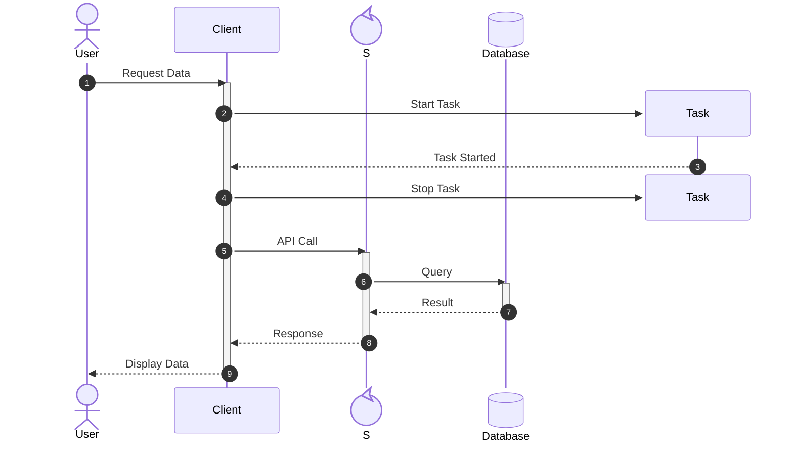

# Update Sequence Diagram

## When to use this skill

Use this skill when creating a new Mermaid sequence diagram or updating an existing one. This covers syntax for participants, messages, activations, notes, loops, alternative paths, and parallel actions.

## Instructions

1.  **Start with `sequenceDiagram`**: Every sequence diagram must start with this keyword.
2.  **Define Participants (Optional)**:
    -   Implicit: `Alice->>Bob: Hello John, how are you?`
    -   Explicit: `participant Alice` or `participant A as Alice`
    -   **Participant Types**:
        -   `actor Alice` (Stick figure)
        -   `participant Alice @{ "type": "boundary" }`
        -   `participant Alice @{ "type": "control" }`
        -   `participant Alice @{ "type": "entity" }`
        -   `participant Alice @{ "type": "database" }`
        -   `participant Alice @{ "type": "collections" }`
        -   `participant Alice @{ "type": "queue" }`
        -   *Note: Do not use `as` alias and `@{ "type": ... }` simultaneously.*
3.  **Actor Creation and Destruction**:
    -   **Create**: Add `create participant <Name>` before the message that creates it.
        ```mermaid
        create participant B
        A->>B: Hello
        ```
    -   **Destroy**: Add `destroy <Name>` before the message that destroys it.
        ```mermaid
        destroy B
        A->>B: Delete
        ```
4.  **Use Correct Message Syntax**:
    -   `->`  Solid line without arrow
    -   `-->` Dotted line without arrow
    -   `->>` Solid line with arrowhead
    -   `-->>` Dotted line with arrowhead
    -   `-x`  Solid line with a cross at the end
    -   `--x` Dotted line with a cross at the end
    -   `-)`  Solid line with an open arrow at the end (async)
    -   `--)` Dotted line with an open arrow at the end (async)
5.  **Manage Activations**:
    -   Explicit: `activate Alice` ... `deactivate Alice`
    -   Shorthand: `Alice->>+Bob: Hello` (activate Bob), `Bob-->>-Alice: Hi` (deactivate Bob)
6.  **Add Notes**:
    -   `Note right of Alice: Text`
    -   `Note left of Alice: Text`
    -   `Note over Alice: Text`
    -   `Note over Alice,Bob: Text spanning both`
7.  **Control Flow**:
    -   **Loop**: `loop Loop text ... end`
    -   **Alt**: `alt Describing text ... else ... end`
    -   **Opt**: `opt Describing text ... end`
    -   **Par**: `par [Action 1] ... and [Action 2] ... end`
    -   **Critical**: `critical [Action] ... option [Circumstance] ... end`
    -   **Break**: `break [something happened] ... end`
8.  **Multi-line Text**: Use `<br/>` instead of `\n` for line breaks in messages and notes.
9.  **Background Highlighting**:
    -   `rect rgb(0, 255, 0) ... end`
    -   `rect rgba(0, 0, 255, .1) ... end`
10. **Sequence Numbers**:
    -   Add `autonumber` to the beginning of the diagram to automatically number messages.

## Example


