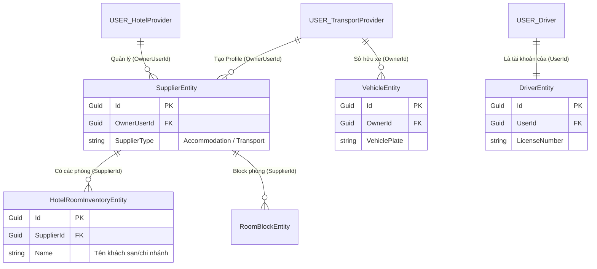

# Database Schema: HotelProvider & TransportProvider Roles

Tài liệu này mô tả chi tiết các thuộc tính (attributes) trong các bảng cơ sở dữ liệu (Entities) liên quan trực tiếp đến hai vai trò: **HotelProvider** (Nhà cung cấp lưu trú) và **TransportProvider** (Nhà cung cấp vận chuyển) trong dự án Pathora.

---

## Sơ Đồ Quan Hệ (ER Diagram) & Thứ Tự Đọc

Để có cái nhìn tổng quan trước khi đi vào chi tiết từng bảng, hãy xem qua sơ đồ thực thể (Entity-Relationship) dưới đây. Sơ đồ này làm rõ sự khác biệt trong tư duy tổ chức dữ liệu giữa hai mảng Dịch vụ lưu trú và Vận chuyển.

### Hướng dẫn thứ tự đọc (How to read this flow):

1.  **Đọc từ góc nhìn User (Trên cùng):**
    *   Hãy nhìn vào 3 loại User: `USER_HotelProvider`, `USER_TransportProvider`, và `USER_Driver`.
2.  **Đọc nhánh bên trái (HotelProvider - Mô hình Phân cấp):**
    *   `HotelProvider` quản lý các `SupplierEntity` (Đóng vai trò là Công ty/Tập đoàn lưu trú).
    *   Từ `SupplierEntity` sẽ rẽ nhánh xuống `HotelRoomInventoryEntity` (Tồn kho phòng). Mỗi Inventory có trường `Name` và `Address` riêng, đóng vai trò như một **Khách sạn chi nhánh**.
    *   $\rightarrow$ **Kết luận nhánh 1:** Hệ thống phân cấp rõ ràng `User` $\rightarrow$ `Công ty mẹ` $\rightarrow$ `Các chi nhánh khách sạn`.
3.  **Đọc nhánh bên phải (TransportProvider - Mô hình Phẳng):**
    *   `TransportProvider` cũng quản lý `SupplierEntity` (Để lấy danh nghĩa Công ty vận tải).
    *   **TUY NHIÊN**, mũi tên quản lý Xe (`VehicleEntity`) lại nối trực tiếp từ `USER_TransportProvider` (qua `OwnerId`), hoàn toàn bỏ qua `SupplierEntity`.
    *   Tài xế (`DriverEntity`) thì nối với một tài khoản độc lập là `USER_Driver` (Tài xế có app riêng).
    *   $\rightarrow$ **Kết luận nhánh 2:** Xe cộ gom chung vào ví của chủ xe (User) chứ không chia theo Công ty.
4.  **Đọc chi tiết các bảng:** Sau khi đã hiểu luồng quan hệ, bạn có thể cuộn xuống phần dưới để đọc chi tiết các thuộc tính (Cột) của từng Table.

---

## 1. Bảng Dùng Chung

Cả 2 role đều chia sẻ một bảng cốt lõi là `SupplierEntity` để định danh nhà cung cấp và quản lý thông tin liên hệ.

### Bảng: `SupplierEntity`
Đại diện cho một nhà cung cấp dịch vụ chung trên hệ thống.

| Thuộc tính | Kiểu dữ liệu | Mô tả |
| :--- | :--- | :--- |
| `Id` | `Guid` | Khóa chính của nhà cung cấp (chuẩn UUID Version 7). |
| `SupplierCode` | `string` | Mã định danh duy nhất của nhà cung cấp (VD: `SUP-HTL-001`). |
| `SupplierType` | `enum` | Phân loại nhà cung cấp (`Transport`, `Accommodation`, `Activity`...). |
| `Name` | `string` | Tên của nhà cung cấp (VD: "InterContinental Hotel", "Vietnam Airlines"). |
| `Phone` | `string?` | Số điện thoại liên hệ. |
| `Email` | `string?` | Địa chỉ email liên hệ. |
| `Address` | `string?` | Địa chỉ trụ sở / văn phòng. |
| `Continent` | `enum?` | Châu lục hoạt động (hỗ trợ việc tìm kiếm/lọc trong tour). |
| `Note` | `string?` | Ghi chú bổ sung dành cho quản trị viên. |
| `OwnerUserId` | `Guid?` | ID của `UserEntity` đang quản lý nhà cung cấp này (Chính là tài khoản HotelProvider hoặc TransportProvider). |
| `IsActive` | `bool` | Cờ xác định nhà cung cấp có đang hoạt động hay không (Mặc định: `true`). |
| `IsDeleted` | `bool` | Cờ xóa mềm (Mặc định: `false`). |

---

## 2. Các Bảng Dành Cho Role `HotelProvider`

Vai trò `HotelProvider` tập trung vào việc quản lý tồn kho phòng khách sạn và lịch giữ chỗ cho các Tour hoặc Booking đơn lẻ.

### 2.1 Bảng: `HotelRoomInventoryEntity`
Quản lý tổng số lượng phòng khả dụng theo từng loại phòng của khách sạn.

| Thuộc tính | Kiểu dữ liệu | Mô tả |
| :--- | :--- | :--- |
| `Id` | `Guid` | Khóa chính của bản ghi tồn kho. |
| `SupplierId` | `Guid` | Khóa ngoại trỏ đến `SupplierEntity` (Khách sạn nào đang cấu hình phòng). |
| `RoomType` | `enum` | Loại phòng tiêu chuẩn (`Standard`, `Deluxe`, `Suite`, `Family`...). |
| `TotalRooms` | `int` | Tổng số lượng phòng thuộc loại này mà khách sạn đang có (Tồn kho tổng). |
| `Name` | `string?` | Tên cụ thể của khách sạn/cơ sở (Nếu có nhiều chi nhánh). |
| `Address` | `string?` | Địa chỉ cụ thể của khách sạn. |
| `LocationArea` | `enum?` | Châu lục/khu vực của cơ sở này. |
| `OperatingCountries`| `string?` | Các quốc gia hỗ trợ, cách nhau bằng dấu phẩy. |
| `ImageUrls` | `string?` | Chuỗi URL chứa ảnh của phòng / khách sạn. |
| `Notes` | `string?` | Ghi chú thêm về cơ sở vật chất, tiện ích phòng. |

### 2.2 Bảng: `RoomBlockEntity`
Theo dõi việc giữ chỗ (block) số lượng phòng vào một ngày cụ thể để phục vụ cho các Tour hoặc Booking, tránh overbooking.

| Thuộc tính | Kiểu dữ liệu | Mô tả |
| :--- | :--- | :--- |
| `Id` | `Guid` | Khóa chính của bản ghi block phòng. |
| `SupplierId` | `Guid` | Khóa ngoại trỏ đến `SupplierEntity` (Khách sạn giữ phòng). |
| `RoomType` | `enum` | Loại phòng đang bị giữ (`Standard`, `Deluxe`...). |
| `BlockedDate` | `DateOnly` | Ngày cụ thể mà phòng bị giữ (Ví dụ: `2024-05-12`). |
| `RoomCountBlocked` | `int` | Số lượng phòng bị khóa lại trong ngày `BlockedDate`. |
| `BookingId` | `Guid?` | (Optional) Khóa ngoại liên kết tới `BookingEntity` (Nếu khách đặt trực tiếp). |
| `BookingAccommodationDetailId`| `Guid?` | (Optional) Chi tiết của booking lưu trú liên quan. |
| `TourInstanceDayActivityId` | `Guid?` | (Optional) Hoạt động lưu trú của Tour liên quan đến việc block phòng này. |

---

## 3. Các Bảng Dành Cho Role `TransportProvider`

Vai trò `TransportProvider` tập trung vào việc đăng ký, quản lý đội phương tiện vận chuyển và hồ sơ các tài xế phụ trách.

### 3.1 Bảng: `VehicleEntity`
Lưu trữ danh sách thông tin chi tiết các loại xe/phương tiện của nhà xe.

| Thuộc tính | Kiểu dữ liệu | Mô tả |
| :--- | :--- | :--- |
| `Id` | `Guid` | Khóa chính của xe. |
| `OwnerId` | `Guid` | Khóa ngoại trỏ đến `UserEntity` (Tài khoản TransportProvider sở hữu xe). |
| `VehiclePlate` | `string` | Biển số xe (Chuẩn hóa in hoa). |
| `VehicleType` | `enum` | Phân loại phương tiện (`Bus`, `Coach`, `Limousine`, `Minibus`...). |
| `Brand` | `string?` | Hãng sản xuất xe (VD: `Hyundai`, `Thaco`, `Isuzu`). |
| `Model` | `string?` | Dòng xe chi tiết. |
| `SeatCapacity` | `int` | Sức chứa / Số ghế ngồi (Dùng để tính toán lượng khách xe có thể chở). |
| `LocationArea` | `enum?` | Khu vực địa lý xe được phép chạy (Châu lục). |
| `OperatingCountries`| `string?` | Mã các quốc gia (ISO 2 chữ cái) xe được phép đi qua, phân cách bằng dấu phẩy (VD: `VN,TH`). |
| `VehicleImageUrls`| `string?` | URL hình ảnh xe. |
| `IsActive` | `bool` | Cờ trạng thái xe có đang sẵn sàng hoạt động không. |
| `IsDeleted` | `bool` | Cờ xóa mềm. |
| `Notes` | `string?` | Ghi chú (VD: Xe mới bảo dưỡng, có WC trên xe...). |

### 3.2 Bảng: `DriverEntity`
Quản lý thông tin và hồ sơ của tài xế được phân công lái xe cho các tour.

| Thuộc tính | Kiểu dữ liệu | Mô tả |
| :--- | :--- | :--- |
| `Id` | `Guid` | Khóa chính của hồ sơ tài xế. |
| `UserId` | `Guid` | Khóa ngoại trỏ đến `UserEntity` (Tài khoản để tài xế login nhận lịch). |
| `FullName` | `string` | Họ và tên đầy đủ của tài xế. |
| `LicenseNumber` | `string` | Số bằng lái xe. |
| `LicenseType` | `enum` | Hạng bằng lái (`A1`, `B2`, `C`, `D`, `E`...). |
| `PhoneNumber` | `string` | Số điện thoại liên hệ trực tiếp của tài xế. |
| `AvatarUrl` | `string?` | Ảnh đại diện của tài xế. |
| `IsActive` | `bool` | Cờ trạng thái tài xế có đang làm việc không. |
| `Notes` | `string?` | Ghi chú thêm (Kinh nghiệm, bằng cấp phụ...). |

---

## 4. Phân Tích Kiến Trúc & Điểm Cần Cải Thiện

Mặc dù `HotelProvider` và `TransportProvider` có chung bảng `SupplierEntity`, nhưng hiện tại cấu trúc lưu trữ chi tiết của chúng có sự khác biệt lớn về mặt kiến trúc:

### 4.1 Điểm khác biệt trong Hierarchical Structure (Phân cấp)

*   **Lưu trú (HotelProvider):** Tổ chức theo mô hình **Phân cấp**. 
    *   `User` $\rightarrow$ N `SupplierEntity` $\rightarrow$ N `HotelRoomInventoryEntity`
    *   Tồn kho phòng trỏ khóa ngoại về `SupplierId`. Điều này giúp 1 người dùng có thể quản lý nhiều chuỗi / thương hiệu, mỗi thương hiệu lại có chi nhánh riêng (thông qua `Name`/`Address` của bảng Inventory).
*   **Vận chuyển (TransportProvider):** Tổ chức theo mô hình **Phẳng**. 
    *   `User` $\rightarrow$ N `VehicleEntity` / `DriverEntity`
    *   Các bảng `VehicleEntity` và `DriverEntity` đang trỏ thẳng khóa ngoại về `OwnerId` / `UserId` thay vì `SupplierId`.

### 4.2 Điểm yếu (Bottleneck) hiện tại của TransportProvider

1.  **Quản lý tập trung không thể phân nhánh:** Toàn bộ xe và tài xế bị gom vào 1 tập hợp (pool) duy nhất dưới danh nghĩa 1 tài khoản `UserEntity`. Cho dù `TransportProvider` có tạo 10 công ty xe (10 `SupplierEntity`), họ cũng không thể chỉ định xe X thuộc công ty A, xe Y thuộc công ty B.
2.  **Bỏ qua Supplier trong nghiệp vụ cốt lõi:** Khi Booking Tour phân công vận chuyển (`TourDayActivityRouteTransportEntity`), hệ thống gán trực tiếp ID Xe và ID Tài xế. Sự tồn tại của `SupplierEntity` cho Transport hiện tại chỉ mang ý nghĩa lý lịch doanh nghiệp (Profile) chứ không tham gia vào luồng điều phối thực tế.

### 4.3 Đề xuất cải thiện kiến trúc

Để TransportProvider đạt được độ linh hoạt (Scalability) như HotelProvider, cần thực hiện refactor Database như sau:

*   **Sửa đổi `VehicleEntity`:** Đổi khóa ngoại `OwnerId (Guid)` thành `SupplierId (Guid)`. Mỗi chiếc xe phải thuộc về 1 `Supplier` (Doanh nghiệp/Nhà xe) cụ thể.
*   **Thêm `SupplierId` vào `DriverEntity`:** (Tuỳ chọn) Nếu tài xế ký hợp đồng với 1 nhà xe nhất định, tài xế cũng nên được liên kết với `SupplierEntity` thay vì chỉ trỏ về `UserId`.
*   **Kết quả đạt được:** `User` (TransportProvider) có thể tạo ra nhiều Công ty vận tải. Ở mỗi Công ty, họ thêm các xe tương ứng vào. Từ đó, báo cáo, doanh thu và việc phân bổ xe sẽ rõ ràng theo từng chi nhánh/thương hiệu doanh nghiệp.

---
*Tài liệu được sinh tự động dựa trên Entities của backend (.NET).*
