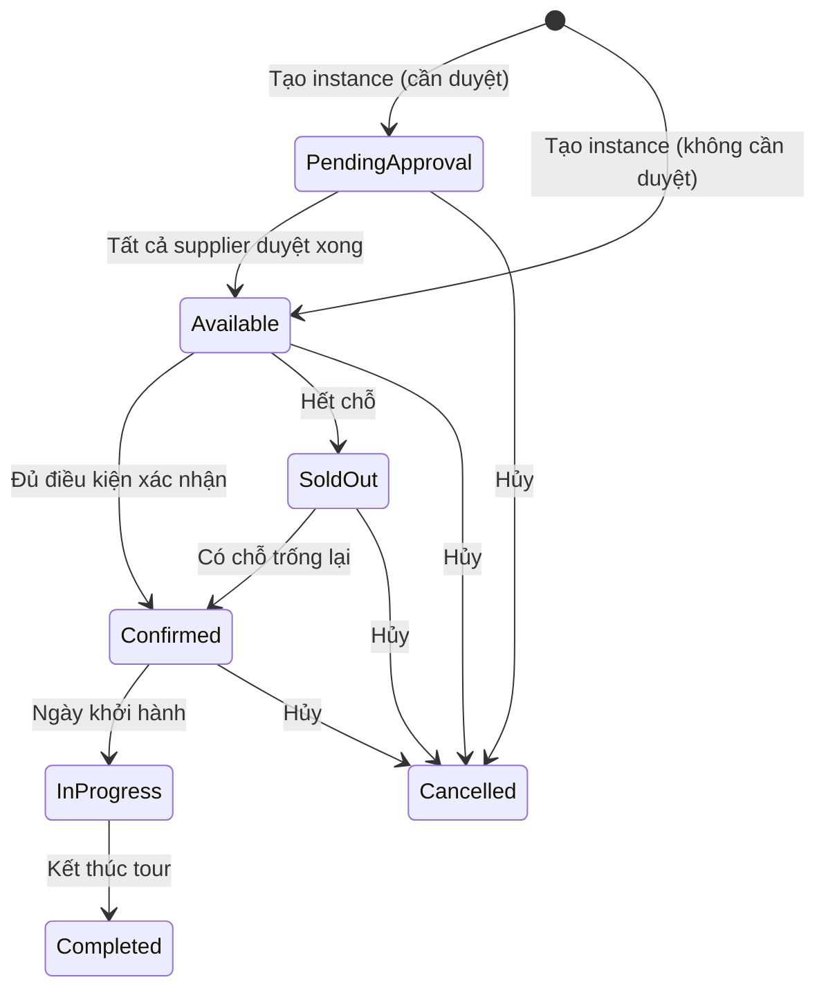
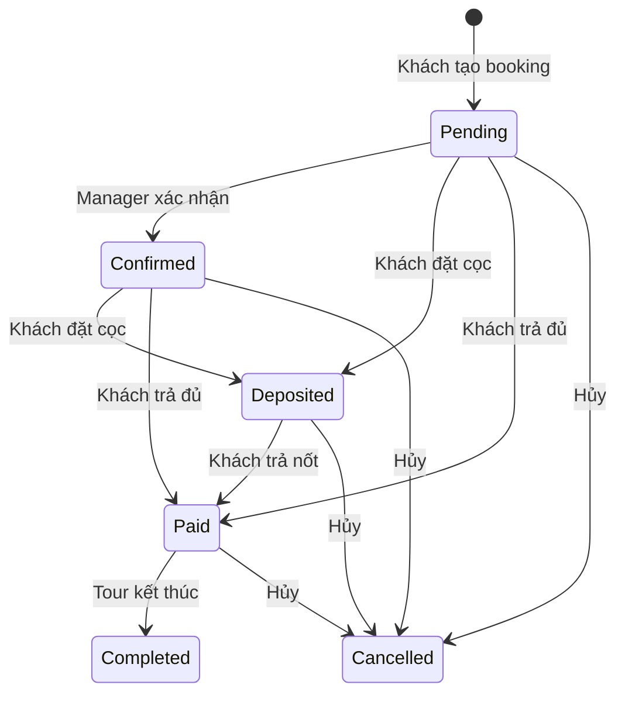
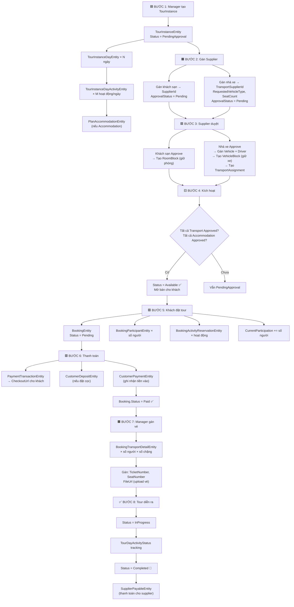

# Luồng Vòng đời Tour Instance — Từ Tạo đến Hoàn thành

## Tổng quan

Tài liệu này mô tả toàn bộ luồng xử lý dữ liệu của một **TourInstance** từ lúc Manager tạo đợt tour, qua các bước duyệt khách sạn/xe, khách đặt và thanh toán, đến khi tour hoàn thành.

---

## 1. Sơ đồ trạng thái TourInstance



**Enum `TourInstanceStatus`:** PendingApproval(7) → Available(1) → Confirmed(2) / SoldOut(3) → InProgress(4) → Completed(5) / Cancelled(6)

---

## 2. Sơ đồ trạng thái Booking



**Enum `BookingStatus`:** Pending(1) → Confirmed(2) → Deposited(3) → Paid(4) → Completed(6) / Cancelled(5)

---

## 3. Luồng chi tiết từng bước

### BƯỚC 1: Manager tạo TourInstance

**Entity chính:** `TourInstanceEntity`

| Thuộc tính | Giá trị khi tạo | Mô tả |
|---|---|---|
| `Id` | Guid v7 tự sinh | Khóa chính |
| `TourId` | FK → Tour gốc | Tour mẫu |
| `ClassificationId` | FK → Classification | Hạng tour |
| `TourInstanceCode` | `TI-yyyyMMddHHmmss-NNNN` | Mã tự sinh |
| `Title` | Do Manager nhập | Tiêu đề đợt |
| `TourName` / `TourCode` | Copy từ Tour | Denormalized |
| `ClassificationName` | Copy từ Classification | Denormalized |
| `InstanceType` | Public hoặc Private | Loại tour |
| `Status` | **PendingApproval** hoặc **Available** | Tùy `requiresApproval` |
| `StartDate` / `EndDate` | Do Manager chọn | Lịch trình |
| `DurationDays` | Tính tự động | `EndDate - StartDate + 1` |
| `MaxParticipation` | Do Manager nhập | Số chỗ tối đa |
| `CurrentParticipation` | **0** | Chưa có ai đặt |
| `BasePrice` | Snapshot từ Classification | Giá cơ bản |
| `Location` | Tùy chọn | Địa điểm |
| `Thumbnail` / `Images` | Ảnh upload | Media |
| `ConfirmationDeadline` | Tùy chọn | Hạn xác nhận |
| `IncludedServices` | Danh sách string | Dịch vụ kèm |
| `IsDeleted` | false | Xóa mềm |
| `RowVersion` | EF auto | Concurrency token |

**Đồng thời tạo các entity con:**

#### 1a. `TourInstanceDayEntity` (mỗi ngày trong tour)

| Thuộc tính | Mô tả |
|---|---|
| `TourInstanceId` | FK → Instance cha |
| `TourDayId` | FK → ngày gốc từ Classification |
| `InstanceDayNumber` | Thứ tự: 1, 2, 3... |
| `ActualDate` | Ngày thực tế trên lịch |
| `Title` / `Description` | Nội dung ngày |
| `Activities` | Danh sách hoạt động con |

#### 1b. `TourInstanceDayActivityEntity` (mỗi hoạt động trong ngày)

| Thuộc tính | Mô tả |
|---|---|
| `TourInstanceDayId` | FK → ngày cha |
| `Order` | Thứ tự hoạt động |
| `ActivityType` | Sightseeing / Meal / **Transportation** / **Accommodation** / FreeTime |
| `Title` / `Description` | Nội dung |
| `StartTime` / `EndTime` | Giờ bắt đầu/kết thúc |
| `IsOptional` | Hoạt động tùy chọn? |

**Nếu ActivityType = Transportation:** hệ thống phân hai nhóm (xem thêm `openspec/changes/split-ground-vs-external-transport` và `docs/explore-transport-ground-vs-external.md`):

- **Ground (xe mặt đất trong app):** có nhà cung cấp xe nội bộ, duyệt xe/tài xế, `VehicleBlock` — đúng như các bước 2b / 3b / 4 bên dưới.
- **External (vé máy bay, tàu, phà, … do Manager đặt ngoài):** **không** dùng nhà xe trong app; chỉ lưu thông tin tham chiếu trên activity. `TransportSupplierId` **giữ NULL**; không có luồng gán nhà xe / duyệt nhà xe; chặng này **không** chặn kích hoạt instance vì thiếu duyệt transport (chỉ các chặng Ground có supplier mới tính vào `AreAllTransportationApproved()`).

##### Trường chung mọi Transportation

| Thuộc tính | Mô tả |
|---|---|
| `FromLocationId` / `ToLocationId` | Điểm đi / đến (nếu có) |
| `TransportationType` | Phân loại: Bus, Car, **Flight**, **Train**, Ferry, … (dùng để biết Ground vs External) |
| `TransportationName` | Tên hiển thị / hãng / số hiệu chuyến (vd. “VN123”, “SE1”) |

##### Chỉ áp dụng **Ground** (xe + nhà xe trong hệ thống)

| Thuộc tính | Mô tả |
|---|---|
| `TransportSupplierId` | FK → Nhà cung cấp xe (**NULL lúc tạo**, Manager gán ở BƯỚC 2b) |
| `RequestedVehicleType` | Loại xe yêu cầu (**NULL lúc tạo**, điền khi gán nhà xe) |
| `RequestedSeatCount` | Số ghế yêu cầu (áp cho Ground; so với `MaxParticipation` theo rule validator) |
| `RequestedVehicleCount` | Số xe yêu cầu (tùy chọn) |
| `VehicleId` / `DriverId` | Xe/tài xế cụ thể (**NULL** cho đến khi nhà xe duyệt — BƯỚC 3b) |
| `TransportationApprovalStatus` | **Pending** → **Approved** sau khi nhà xe duyệt |
| `TransportAssignments` | Danh sách xe gán (rỗng lúc tạo; multi-vehicle nếu dùng) |

##### Chỉ áp dụng **External** (vé máy bay / tàu / phà — không nhà xe app)

| Thuộc tính | Mô tả |
|---|---|
| `TransportSupplierId` | **Luôn NULL** — không có “nhà xe” nội bộ cho chặng này |
| `RequestedVehicleType` / `RequestedSeatCount` / `RequestedVehicleCount` | **Không dùng** cho luồng External (hoặc NULL); không bắt buộc khi tạo instance |
| `VehicleId` / `DriverId` | **NULL** — không gán xe/tài xế trong app |
| `BookingReference` | Mã đặt chỗ / PNR / mã vé (nếu Manager nhập lúc lên kế hoạch) |
| `Price` | Giá vé tham chiếu (nếu có) |
| `DepartureTime` / `ArrivalTime` | Giờ cất cánh / ga / cảng (nếu dùng) |
| `TransportationApprovalStatus` | Có thể **Pending** / không dùng cho cổng duyệt nhà xe — **quan trọng:** kích hoạt instance không đợi duyệt “transport” kiểu Ground cho chặng External |
| `TransportAssignments` | **Rỗng** — không tạo `VehicleBlock` cho External |

**Sau khi khách đã trả tiền (giai đoạn sản phẩm tiếp theo):** Manager có thể đính file/URL vé (vd. qua `BookingTransportDetailEntity.FileUrl`) và liên kết đúng chặng instance — chi tiết trong cùng initiative OpenSpec (phase 2). Trong tài liệu luồng này, BƯỚC 1 chỉ mô tả dữ liệu **trên instance activity**; vé khách cá nhân có thể bổ sung sau trên booking.

**Nếu ActivityType = Accommodation → tạo thêm:**

#### 1c. `TourInstancePlanAccommodationEntity`

| Thuộc tính | Mô tả |
|---|---|
| `TourInstanceDayActivityId` | FK → Activity cha |
| `SupplierId` | FK → Khách sạn (NULL hoặc có sẵn) |
| `SupplierApprovalStatus` | **NotAssigned** hoặc **Pending** |
| `RoomType` | Loại phòng |
| `Quantity` | Số phòng yêu cầu |
| `CheckInTime` / `CheckOutTime` | Giờ nhận/trả phòng |

---

### BƯỚC 2: Manager gán Nhà cung cấp (Supplier)

#### 2a. Gán Khách sạn

Manager gọi `AssignSupplier(supplierId)` trên `TourInstancePlanAccommodationEntity`:
- `SupplierId` ← ID khách sạn
- `SupplierApprovalStatus` ← **Pending**

#### 2b. Gán Nhà xe (**chỉ chặng Ground**)

Áp dụng khi activity là **Transportation kiểu Ground** (xe mặt đất, có nhà cung cấp xe trong hệ thống).

Manager gọi `AssignTransportSupplier()` trên `TourInstanceDayActivityEntity`:
- `TransportSupplierId` ← ID nhà xe
- `RequestedVehicleType` ← loại xe (Bus, Car...)
- `RequestedSeatCount` ← số ghế ≥ MaxParticipation
- `RequestedVehicleCount` ← số xe (tùy chọn)
- `TransportationApprovalStatus` ← **Pending**
- Reset: `VehicleId = null`, `DriverId = null`, xóa `TransportAssignments`

**Không có bước “gán nhà xe” cho External:** vé máy bay / tàu / phà chỉ cần Manager nhập/sửa các trường tham chiếu trên activity (điểm đi/đến, loại, tên chuyến, PNR, giờ, giá…). UI tạo/sửa instance ẩn picker nhà xe + loại xe đối với các `TransportationType` được coi là External.

---

### BƯỚC 3: Nhà cung cấp Duyệt

#### 3a. Khách sạn duyệt phòng

Khách sạn gọi `ApproveBySupplier(true, note)` trên `TourInstancePlanAccommodationEntity`:
- `SupplierApprovalStatus` ← **Approved**
- Hệ thống tạo `RoomBlockEntity` để giữ chỗ phòng:

| Thuộc tính RoomBlock | Mô tả |
|---|---|
| `SupplierId` | Khách sạn |
| `RoomType` | Loại phòng |
| `TourInstanceDayActivityId` | Activity lưu trú |
| `BlockedDate` | Ngày giữ phòng |
| `RoomCountBlocked` | Số phòng giữ |
| `HoldStatus` | **Hard** (giữ chắc) |

#### 3b. Nhà xe duyệt xe + tài xế (**chỉ chặng Ground**)

Chỉ áp dụng khi activity có `TransportSupplierId` (vận chuyển Ground). Chặng **External** không có nhà xe duyệt trong app.

Nhà xe gọi `ApproveTransportation(vehicleId, driverId, note)` trên `TourInstanceDayActivityEntity`:
- `VehicleId` ← xe cụ thể
- `DriverId` ← tài xế
- `TransportationApprovalStatus` ← **Approved**

Hoặc dùng multi-vehicle qua `TourInstanceTransportAssignmentEntity`:

| Thuộc tính Assignment | Mô tả |
|---|---|
| `TourInstanceDayActivityId` | Activity vận chuyển |
| `VehicleId` | Xe cụ thể |
| `DriverId` | Tài xế (tùy chọn) |
| `SeatCountSnapshot` | Copy sức chứa xe tại thời điểm duyệt |

Hệ thống tạo `VehicleBlockEntity` để giữ xe:

| Thuộc tính VehicleBlock | Mô tả |
|---|---|
| `VehicleId` | Xe bị block |
| `TourInstanceDayActivityId` | Activity vận chuyển |
| `BlockedDate` | Ngày giữ xe |
| `HoldStatus` | **Hard** |

---

### BƯỚC 4: Kích hoạt Tour Instance

Sau khi tất cả supplier duyệt xong, hệ thống gọi `CheckAndActivateTourInstance()`:

```
if (Status != PendingApproval) return;

transportOk = AreAllTransportationApproved()
  → Chỉ lọc activity Transportation **có TransportSupplierId** (tức chặng Ground đã gán nhà xe)
  → Các chặng **External** (không có supplier) **không** đưa vào điều kiện này
  → Mọi chặng Ground trong tập lọc phải Approved

accommodationsOk = AreAllAccommodationsApproved()
  → Lọc activity Accommodation có SupplierId
  → Tất cả phải Approved

if (transportOk && accommodationsOk)
  → Status = Available ✅
```

**Kết quả:** `TourInstance.Status` chuyển từ **PendingApproval** → **Available** (mở bán cho khách)

---

### BƯỚC 5: Khách đặt tour (Booking)

Khách tạo `BookingEntity`:

| Thuộc tính | Giá trị | Mô tả |
|---|---|---|
| `TourInstanceId` | FK → Instance | Đợt tour đặt |
| `UserId` | FK → User (nullable) | Khách đăng nhập |
| `CustomerName` / `Phone` / `Email` | Thông tin khách | Bắt buộc |
| `NumberAdult` | ≥ 1 | Số người lớn |
| `NumberChild` | ≥ 0 | Trẻ em 2-11 tuổi |
| `NumberInfant` | ≥ 0 | Em bé < 2 tuổi |
| `TotalPrice` | Tính từ BasePrice × số người | Tổng giá |
| `PaymentMethod` | VNPay / MoMo / BankTransfer | Cổng thanh toán |
| `IsFullPay` | true/false | Trả đủ hay đặt cọc |
| `BookingType` | InstanceJoin / Private | Loại booking |
| `Status` | **Pending** | Chờ xử lý |

**Đồng thời:**
- `TourInstance.AddParticipant(totalParticipants)` → tăng `CurrentParticipation`
- Nếu `CurrentParticipation == MaxParticipation` → có thể chuyển **SoldOut**

#### 5a. Tạo danh sách người tham gia

Mỗi người → `BookingParticipantEntity`:

| Thuộc tính | Mô tả |
|---|---|
| `BookingId` | FK → Booking |
| `ParticipantType` | Adult / Child / Infant |
| `FullName` | Họ tên |
| `DateOfBirth` / `Gender` / `Nationality` | Thông tin cá nhân |
| `Status` | **Pending** |
| `Passport` | Thông tin hộ chiếu (nếu có) |
| `VisaApplications` | Hồ sơ visa (nếu có) |

#### 5b. Tạo hoạt động đã đặt

Mỗi hoạt động → `BookingActivityReservationEntity`:

| Thuộc tính | Mô tả |
|---|---|
| `BookingId` | FK → Booking |
| `SupplierId` | Nhà cung cấp |
| `ActivityType` | Loại hoạt động |
| `Title` | Tên hoạt động |
| `TotalServicePrice` | Giá chưa thuế |
| `TotalServicePriceAfterTax` | Giá sau thuế |
| `Status` | **Pending** |
| `TransportDetails` | Chi tiết vận chuyển con |
| `AccommodationDetails` | Chi tiết lưu trú con |

---

### BƯỚC 6: Thanh toán

#### 6a. Tạo giao dịch

`PaymentTransactionEntity`:

| Thuộc tính | Mô tả |
|---|---|
| `BookingId` | FK → Booking |
| `TransactionCode` | Mã giao dịch nội bộ |
| `Type` | Deposit / FullPayment / Refund |
| `Status` | **Pending** → Processing → Completed/Failed |
| `Amount` | Số tiền cần thanh toán |
| `PaymentMethod` | VNPay / MoMo / Sepay |
| `CheckoutUrl` | URL thanh toán cho khách |
| `ReferenceCode` | Mã đối soát ngân hàng (max 12 ký tự) |
| `ExpiredAt` | Hạn thanh toán |

#### 6b. Nếu đặt cọc → `CustomerDepositEntity`

| Thuộc tính | Mô tả |
|---|---|
| `BookingId` | FK → Booking |
| `DepositOrder` | Đợt cọc: 1, 2, 3... |
| `ExpectedAmount` | Số tiền cọc dự kiến |
| `DueAt` | Hạn thanh toán cọc |
| `Status` | Pending → **Paid** / Overdue / Waived |

#### 6c. Ghi nhận thanh toán → `CustomerPaymentEntity`

| Thuộc tính | Mô tả |
|---|---|
| `BookingId` | FK → Booking |
| `CustomerDepositId` | FK → đợt cọc (nullable) |
| `Amount` | Số tiền thanh toán |
| `PaymentMethod` | Cổng thanh toán |
| `TransactionRef` | Tham chiếu giao dịch |
| `PaidAt` | Thời gian thanh toán |

#### 6d. Cập nhật Booking Status

```
Webhook/callback thành công
  → PaymentTransaction.MarkAsPaid(amount, paidAt)
  → Booking trạng thái chuyển:
    - Nếu đặt cọc: Pending → Deposited
    - Nếu trả đủ: Deposited → Paid (hoặc Pending → Paid)
```

---

### BƯỚC 7: Manager gán vé sau thanh toán (Giai đoạn 2)

Sau khi `Booking.Status == Paid`, Manager gán chi tiết vé cho từng chặng vận chuyển.

**Entity:** `BookingTransportDetailEntity`

| Thuộc tính | Mô tả |
|---|---|
| `BookingActivityReservationId` | FK → Activity đã đặt |
| `SupplierId` | Hãng vận chuyển |
| `TransportType` | Flight / Train / Bus / Car / Ferry |
| `DepartureAt` / `ArrivalAt` | Giờ đi / đến |
| `TicketNumber` | Số vé |
| `ETicketNumber` | Số vé điện tử |
| `SeatNumber` | Số ghế |
| `SeatCapacity` | Sức chứa |
| `SeatClass` | Hạng ghế (Economy, Business...) |
| `VehicleNumber` | Biển số xe / mã chuyến bay |
| `BuyPrice` | Giá mua chưa thuế |
| `TaxRate` / `TotalBuyPrice` | Thuế và tổng giá |
| `FileUrl` | **URL file vé/hóa đơn** (Manager upload) |
| `SpecialRequest` | Yêu cầu đặc biệt |
| `Status` | Pending → Confirmed |

> **Quan trọng:** Số lượng `BookingTransportDetail` tạo ra phụ thuộc vào số người trong booking (`NumberAdult + NumberChild + NumberInfant`) × số chặng vận chuyển. Manager gán vé theo đúng số người tham gia.

---

### BƯỚC 8: Tour diễn ra và hoàn thành

```
Ngày khởi hành đến:
  → TourInstance.ChangeStatus(InProgress)

Tracking theo ngày:
  → TourDayActivityStatusEntity (theo dõi từng hoạt động thực tế)

Tour kết thúc:
  → TourInstance.ChangeStatus(Completed)
  → Booking.Complete() → Status = Completed
  → Phát domain event BookingStatusChangedEvent
```

**Công nợ nhà cung cấp:** `SupplierPayableEntity` theo dõi tiền phải trả cho từng supplier (khách sạn, nhà xe) sau khi tour hoàn thành.

---

## 4. Sơ đồ tổng hợp toàn bộ luồng



---

## 5. Bảng tham chiếu Entity

| Entity | File | Vai trò |
|---|---|---|
| `TourInstanceEntity` | `Domain/Entities/TourInstanceEntity.cs` | Đợt tour chính |
| `TourInstanceDayEntity` | `Domain/Entities/TourInstanceDayEntity.cs` | Ngày trong tour |
| `TourInstanceDayActivityEntity` | `Domain/Entities/TourInstanceDayActivityEntity.cs` | Hoạt động trong ngày |
| `TourInstancePlanAccommodationEntity` | `Domain/Entities/TourInstancePlanAccommodationEntity.cs` | Chi tiết lưu trú |
| `TourInstanceTransportAssignmentEntity` | `Domain/Entities/TourInstanceTransportAssignmentEntity.cs` | Gán xe cụ thể |
| `TourInstanceManagerEntity` | `Domain/Entities/TourInstanceManagerEntity.cs` | Manager phụ trách |
| `RoomBlockEntity` | `Domain/Entities/RoomBlockEntity.cs` | Giữ chỗ phòng |
| `VehicleBlockEntity` | `Domain/Entities/VehicleBlockEntity.cs` | Giữ chỗ xe |
| `BookingEntity` | `Domain/Entities/BookingEntity.cs` | Đặt tour |
| `BookingParticipantEntity` | `Domain/Entities/BookingParticipantEntity.cs` | Người tham gia |
| `BookingActivityReservationEntity` | `Domain/Entities/BookingActivityReservationEntity.cs` | Hoạt động đã đặt |
| `BookingTransportDetailEntity` | `Domain/Entities/BookingTransportDetailEntity.cs` | Chi tiết vé vận chuyển |
| `PaymentTransactionEntity` | `Domain/Entities/PaymentTransactionEntity.cs` | Giao dịch thanh toán |
| `CustomerDepositEntity` | `Domain/Entities/CustomerDepositEntity.cs` | Đợt đặt cọc |
| `CustomerPaymentEntity` | `Domain/Entities/CustomerPaymentEntity.cs` | Khoản thanh toán |
| `SupplierPayableEntity` | `Domain/Entities/SupplierPayableEntity.cs` | Công nợ nhà cung cấp |

---

## 6. Enum tham chiếu

| Enum | Giá trị |
|---|---|
| `TourInstanceStatus` | PendingApproval(7) → Available(1) → Confirmed(2) / SoldOut(3) → InProgress(4) → Completed(5) / Cancelled(6) |
| `BookingStatus` | Pending(1) → Confirmed(2) → Deposited(3) → Paid(4) → Completed(6) / Cancelled(5) |
| `ProviderApprovalStatus` | NotAssigned(0) → Pending(1) → Approved(2) / Rejected(3) |
| `HoldStatus` | Soft / Hard |
| `DepositStatus` | Pending → Paid / Overdue / Waived |
| `TransactionStatus` | Pending → Processing → Completed / Failed / Cancelled / Refunded |
