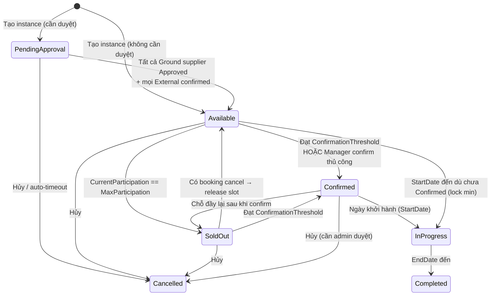
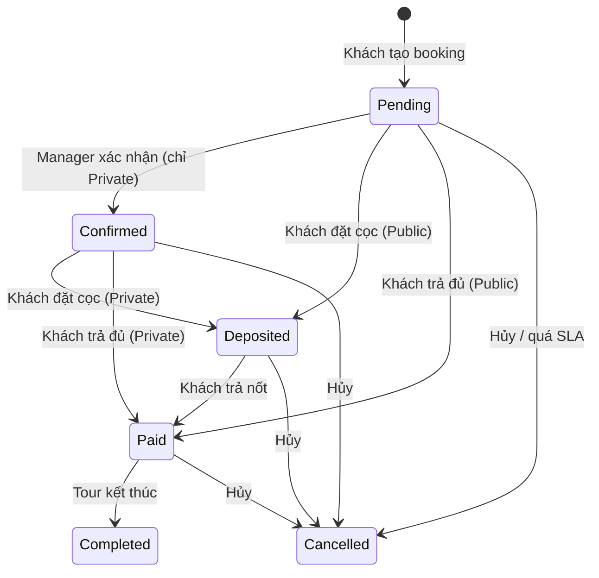
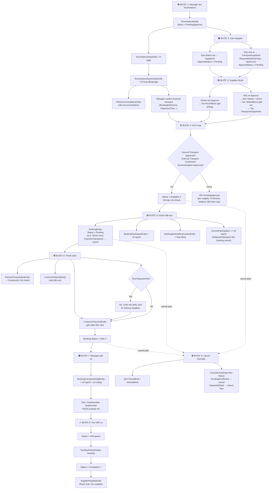

# Luồng Vòng đời Tour Instance — Từ Tạo đến Hoàn thành

## Tổng quan

Tài liệu này mô tả toàn bộ luồng xử lý dữ liệu của một **TourInstance** từ lúc Manager tạo đợt tour, qua các bước duyệt khách sạn/xe, khách đặt và thanh toán, đến khi tour hoàn thành.

---

## 1. Sơ đồ trạng thái TourInstance



**Enum `TourInstanceStatus`:** PendingApproval(7) → Available(1) → Confirmed(2) / SoldOut(3) → InProgress(4) → Completed(5) / Cancelled(6)

**Điều kiện `Available → Confirmed` (làm rõ):**

- **Trigger tự động**: `CurrentParticipation >= TourInstance.MinParticipation` (field đề xuất thêm, hoặc suy từ `Classification.MinParticipation`) **và** `UtcNow >= ConfirmationDeadline` (nếu đã có). Đạt 2 điều kiện này → job auto chuyển `Confirmed`.
- **Trigger thủ công**: Manager phụ trách có thể chuyển `Available → Confirmed` sớm nếu lý do business (VD: đã có đủ nhóm VIP).
- **Ý nghĩa business**: Confirmed = "tour chắc chắn sẽ đi, khóa lại giá, lock lịch với supplier". Sau Confirmed, supplier không được reject (chỉ emergency escalation).
- **Nếu không đạt min đến `StartDate`**: Manager phải hoặc (a) cancel instance (refund hết bookings), hoặc (b) vẫn cho đi với số ít, chuyển thẳng `Available → InProgress` (case "lock min"). Rule này giải thích cạnh trong state machine.

**Ý nghĩa `SoldOut ↔ Available` (bổ sung so với trước):**

- Khi booking bị cancel (thủ công hoặc auto — xem **BƯỚC 5.0**), `ReleaseParticipant` chạy. Nếu instance đang `SoldOut` → quay về `Available`, chứ không nhảy trực tiếp sang `Confirmed`. Cũ ghi "SoldOut → Confirmed : Có chỗ trống lại" là **sai** — đã fix trong diagram.
- `Confirmed → SoldOut` (mới trong diagram): nếu Confirmed rồi mà Manager tăng booking, chạm `MaxParticipation` → chuyển `SoldOut` (vẫn là tour đã chốt sẽ đi).

---

## 2. Sơ đồ trạng thái Booking

Booking có **hai flow song song** tùy `BookingType`:

- **Public (`InstanceJoin`)** — khách book trên đợt tour mở bán, self-service: `Pending → Deposited/Paid → Completed`. State `Confirmed` **không dùng**.
- **Private** — khách liên hệ Manager thương lượng (giá riêng, yêu cầu đặc biệt), Manager chốt trước khi khách trả tiền: `Pending → Confirmed → Deposited/Paid → Completed`.



**Enum `BookingStatus`:** Pending(1) → Confirmed(2) → Deposited(3) → Paid(4) → Completed(6) / Cancelled(5)

**SLA trạng thái Pending (chống slot leakage):**

- Booking `Pending` mà **không có `PaymentTransaction` được tạo** trong **30 phút** kể từ `CreatedOnUtc` → auto-cancel, release slot.
- Booking `Pending` có `PaymentTransaction` nhưng transaction `ExpiredAt` trôi qua mà chưa `Completed` → auto-cancel, release slot.
- Booking `Confirmed` (Private) không chuyển `Deposited/Paid` trong **3 ngày** kể từ `Confirmed` → Manager phải follow-up thủ công (không auto-cancel; private tour có value cao, tránh mất khách do system timeout).
- Chi tiết rule release participant: xem **BƯỚC 5 — Slot Management**.

---

## 3. Luồng chi tiết từng bước

### BƯỚC 0: Manager tạo/sửa Tour (tiền điều kiện cho mọi instance)

`TourInstance` luôn sinh từ một `TourEntity` đã tồn tại và `Status = Active`. Các cờ nghiệp vụ ở cấp Tour **được kế thừa xuống mọi instance**; muốn đổi policy (VD: bật/tắt visa, đổi châu lục) → Manager sửa ở Tour gốc, không sửa per-instance.

**Entity chính:** `TourEntity`

| Thuộc tính | Mô tả | Trạng thái |
|---|---|---|
| `TourCode` | `TOUR-yyyyMMdd-NNNNN` tự sinh | Đã có |
| `TourName` / `ShortDescription` / `LongDescription` | Nội dung hiển thị | Đã có |
| `Status` | Pending → Active → Inactive / Archived | Đã có |
| `TourScope` | **Domestic** (trong VN) / **International** (nước ngoài) | Đã có |
| `Continent` | **Đúng 1 châu lục** (đơn trị, nullable). Bắt buộc khi `TourScope == International`; luôn `null` khi `Domestic`. | Đã có |
| `CustomerSegment` | Group / Family / Couple / Solo / Corporate | Đã có |
| `TourDesignerId` | FK → designer | Đã có |
| `RequiresVisa` | `bool` — tour có yêu cầu khách nộp visa không | **GAP — cần thêm** |
| `RequiredVisaCountries` | `List<string>` ISO 2-ký tự; ⊆ countries thuộc `Continent` | **GAP — cần thêm** |
| `VisaSubmissionDeadlineDays` | `int?` — số ngày trước `TourInstance.StartDate` khách phải nộp xong hồ sơ | **GAP — cần thêm** |

**Validator `CreateTourCommand` / `UpdateTourCommand`:**

- `TourScope == International` → `Continent` bắt buộc (rule đã có).
- `TourScope == Domestic` → `RequiresVisa` bắt buộc `false`.
- `RequiresVisa == true` → `RequiredVisaCountries.Count >= 1` và **mọi country ∈ `ContinentCountries[Continent]`**.
- Mọi `TourPlanLocation.Country` trong lịch trình phải ∈ `ContinentCountries[Continent]` (trừ nước xuất phát VN) → chặn tour nhảy ra ngoài châu lục.

**UI form (frontend `schemas/tour-form/basic-info.schema.ts`):**

- Khối visa **ẩn hoàn toàn** khi `tourScope == Domestic`.
- `International` → hiện toggle `RequiresVisa` + multi-select `RequiredVisaCountries`. Multi-select chỉ list countries thuộc `Continent` đã chọn.
- MVP seed `ContinentCountries` cho **châu Á**; châu lục khác show empty + thông báo "chưa hỗ trợ, liên hệ admin".

**Sau khi Tour có `Status = Active`** → Manager mới được phép tạo `TourInstance` (BƯỚC 1).

---

### BƯỚC 1: Manager tạo TourInstance

**Entity chính:** `TourInstanceEntity`

| Thuộc tính | Giá trị khi tạo | Mô tả |
|---|---|---|
| `Id` | Guid v7 tự sinh | Khóa chính |
| `TourId` | FK → Tour gốc | Tour mẫu |
| `ClassificationId` | FK → Classification | Hạng tour |
| `TourInstanceCode` | `TI-yyyyMMddHHmmss-NNNN` | Mã tự sinh |
| `Title` | Do Manager nhập | Tiêu đề đợt |
| `TourName` / `TourCode` | Copy từ Tour | Denormalized |
| `ClassificationName` | Copy từ Classification | Denormalized |
| `InstanceType` | Public hoặc Private | Loại tour |
| `Status` | **PendingApproval** hoặc **Available** | Tùy `requiresApproval` |
| `StartDate` / `EndDate` | Do Manager chọn | Lịch trình |
| `DurationDays` | Tính tự động | `EndDate - StartDate + 1` |
| `MaxParticipation` | Do Manager nhập | Số chỗ tối đa |
| `CurrentParticipation` | **0** | Chưa có ai đặt |
| `BasePrice` | Snapshot từ Classification | Giá cơ bản |
| `Location` | Tùy chọn | Địa điểm |
| `Thumbnail` / `Images` | Ảnh upload | Media |
| `ConfirmationDeadline` | Tùy chọn | Hạn xác nhận |
| `IncludedServices` | Danh sách string | Dịch vụ kèm |
| `IsDeleted` | false | Xóa mềm |
| `RowVersion` | EF auto | Concurrency token |

> **Kế thừa từ Tour (BƯỚC 0)**: `TourInstance` dùng chung `Continent`, `TourScope`, `RequiresVisa`, `RequiredVisaCountries`, `VisaSubmissionDeadlineDays` của `TourEntity` cha qua navigation `Tour` — **không copy snapshot**.
>
> **Lock policy để tránh hồi tố khách đã book:** `UpdateTourCommandValidator` phải chặn thay đổi visa policy (`RequiresVisa`, `RequiredVisaCountries`, `VisaSubmissionDeadlineDays`, `Continent`, `TourScope`) khi Tour có bất kỳ `TourInstance` nào ở trạng thái `Available / Confirmed / SoldOut / InProgress` **có ít nhất 1 Booking đang active** (Status ∈ { Pending, Confirmed, Deposited, Paid }).
>
> Manager muốn đổi policy sau thời điểm đó → bắt buộc **Archive Tour gốc và clone Tour mới** (giữ nguyên các instance cũ theo policy cũ, các instance mới tạo sau theo policy mới). Tránh tình trạng khách trả tiền cho tour "không cần visa" rồi bị ép nộp visa hồi tố.

**Đồng thời tạo các entity con:**

#### 1a. `TourInstanceDayEntity` (mỗi ngày trong tour)

| Thuộc tính | Mô tả |
|---|---|
| `TourInstanceId` | FK → Instance cha |
| `TourDayId` | FK → ngày gốc từ Classification |
| `InstanceDayNumber` | Thứ tự: 1, 2, 3... |
| `ActualDate` | Ngày thực tế trên lịch |
| `Title` / `Description` | Nội dung ngày |
| `Activities` | Danh sách hoạt động con |

#### 1b. `TourInstanceDayActivityEntity` (mỗi hoạt động trong ngày)

| Thuộc tính | Mô tả |
|---|---|
| `TourInstanceDayId` | FK → ngày cha |
| `Order` | Thứ tự hoạt động |
| `ActivityType` | Sightseeing / Meal / **Transportation** / **Accommodation** / FreeTime |
| `Title` / `Description` | Nội dung |
| `StartTime` / `EndTime` | Giờ bắt đầu/kết thúc |
| `IsOptional` | Hoạt động tùy chọn? |

**Nếu ActivityType = Transportation:** hệ thống phân hai nhóm (xem thêm `openspec/changes/split-ground-vs-external-transport` và `docs/explore-transport-ground-vs-external.md`):

- **Ground (xe mặt đất trong app):** có nhà cung cấp xe nội bộ, duyệt xe/tài xế, `VehicleBlock` — đúng như các bước 2b / 3b / 4 bên dưới.
- **External (vé máy bay, tàu, phà, … do Manager đặt ngoài):** **không** dùng nhà xe trong app; chỉ lưu thông tin tham chiếu trên activity. `TransportSupplierId` **giữ NULL**; không có luồng gán nhà xe / duyệt nhà xe; chặng này **không** chặn kích hoạt instance vì thiếu duyệt transport (chỉ các chặng Ground có supplier mới tính vào `AreAllTransportationApproved()`).

##### Trường chung mọi Transportation

| Thuộc tính | Mô tả |
|---|---|
| `FromLocationId` / `ToLocationId` | Điểm đi / đến (nếu có) |
| `TransportationType` | Phân loại: Bus, Car, **Flight**, **Train**, Ferry, … (dùng để biết Ground vs External) |
| `TransportationName` | Tên hiển thị / hãng / số hiệu chuyến (vd. “VN123”, “SE1”) |

##### Chỉ áp dụng **Ground** (xe + nhà xe trong hệ thống)

| Thuộc tính | Mô tả |
|---|---|
| `TransportSupplierId` | FK → Nhà cung cấp xe (**NULL lúc tạo**, Manager gán ở BƯỚC 2b) |
| `RequestedVehicleType` | Loại xe yêu cầu (**NULL lúc tạo**, điền khi gán nhà xe) |
| `RequestedSeatCount` | Số ghế yêu cầu (áp cho Ground; so với `MaxParticipation` theo rule validator) |
| `RequestedVehicleCount` | Số xe yêu cầu (tùy chọn) |
| `VehicleId` / `DriverId` | Xe/tài xế cụ thể (**NULL** cho đến khi nhà xe duyệt — BƯỚC 3b) |
| `TransportationApprovalStatus` | **Pending** → **Approved** sau khi nhà xe duyệt |
| `TransportAssignments` | Danh sách xe gán (rỗng lúc tạo; multi-vehicle nếu dùng) |

##### Chỉ áp dụng **External** (vé máy bay / tàu / phà — không nhà xe app)

| Thuộc tính | Mô tả |
|---|---|
| `TransportSupplierId` | **Luôn NULL** — không có “nhà xe” nội bộ cho chặng này |
| `RequestedVehicleType` / `RequestedSeatCount` / `RequestedVehicleCount` | **Không dùng** cho luồng External (hoặc NULL); không bắt buộc khi tạo instance |
| `VehicleId` / `DriverId` | **NULL** — không gán xe/tài xế trong app |
| `BookingReference` | Mã đặt chỗ / PNR / mã vé (nếu Manager nhập lúc lên kế hoạch) |
| `Price` | Giá vé tham chiếu (nếu có) |
| `DepartureTime` / `ArrivalTime` | Giờ cất cánh / ga / cảng (nếu dùng) |
| `TransportationApprovalStatus` | Không dùng cho cổng duyệt nhà xe — External **không** dựa vào luồng approval của supplier |
| `ExternalTransportConfirmed` | **bool, default false** — cờ Manager tự check-off xác nhận "tôi đã đặt xong vé ngoài hệ thống". Chặn kích hoạt instance (BƯỚC 4) khi còn chặng External chưa confirmed. |
| `ExternalTransportConfirmedAt` / `ExternalTransportConfirmedBy` | Audit: thời gian và userId Manager confirm |
| `TransportAssignments` | **Rỗng** — không tạo `VehicleBlock` cho External |

**Rule để được bật `ExternalTransportConfirmed = true`:**
- `BookingReference` không rỗng (có PNR / mã vé thật).
- `DepartureTime` và `ArrivalTime` đã nhập.
- Nếu cần chặt hơn: upload file vé tham chiếu (optional, có thể polish sau MVP).

Manager **không thể** bật confirm khi thiếu thông tin cơ bản → giảm rủi ro "click nhầm confirm" rồi tour bán không có vé thật.

**Sau khi khách đã trả tiền (giai đoạn sản phẩm tiếp theo):** Manager có thể đính file/URL vé (vd. qua `BookingTransportDetailEntity.FileUrl`) và liên kết đúng chặng instance — chi tiết trong cùng initiative OpenSpec (phase 2). Trong tài liệu luồng này, BƯỚC 1 chỉ mô tả dữ liệu **trên instance activity**; vé khách cá nhân có thể bổ sung sau trên booking.

**Nếu ActivityType = Accommodation → tạo thêm:**

#### 1c. `TourInstancePlanAccommodationEntity`

| Thuộc tính | Mô tả |
|---|---|
| `TourInstanceDayActivityId` | FK → Activity cha |
| `SupplierId` | FK → Khách sạn (NULL hoặc có sẵn) |
| `SupplierApprovalStatus` | **NotAssigned** hoặc **Pending** |
| `RoomType` | Loại phòng |
| `Quantity` | Số phòng yêu cầu |
| `CheckInTime` / `CheckOutTime` | Giờ nhận/trả phòng |

---

### BƯỚC 2: Manager gán Nhà cung cấp (Supplier)

#### 2a. Gán Khách sạn

Manager gọi `AssignSupplier(supplierId)` trên `TourInstancePlanAccommodationEntity`:
- `SupplierId` ← ID khách sạn
- `SupplierApprovalStatus` ← **Pending**

#### 2b. Gán Nhà xe (**chỉ chặng Ground**)

Áp dụng khi activity là **Transportation kiểu Ground** (xe mặt đất, có nhà cung cấp xe trong hệ thống).

Manager gọi `AssignTransportSupplier()` trên `TourInstanceDayActivityEntity`:
- `TransportSupplierId` ← ID nhà xe
- `RequestedVehicleType` ← loại xe (Bus, Car...)
- `RequestedSeatCount` ← số ghế ≥ MaxParticipation
- `RequestedVehicleCount` ← số xe (tùy chọn)
- `TransportationApprovalStatus` ← **Pending**
- Reset: `VehicleId = null`, `DriverId = null`, xóa `TransportAssignments`

**Không có bước “gán nhà xe” cho External:** vé máy bay / tàu / phà chỉ cần Manager nhập/sửa các trường tham chiếu trên activity (điểm đi/đến, loại, tên chuyến, PNR, giờ, giá…). UI tạo/sửa instance ẩn picker nhà xe + loại xe đối với các `TransportationType` được coi là External.

---

### BƯỚC 3: Nhà cung cấp Duyệt

#### 3a. Khách sạn duyệt phòng

Khách sạn gọi `ApproveBySupplier(true, note)` trên `TourInstancePlanAccommodationEntity`:
- `SupplierApprovalStatus` ← **Approved**
- Hệ thống tạo `RoomBlockEntity` để giữ chỗ phòng:

| Thuộc tính RoomBlock | Mô tả |
|---|---|
| `SupplierId` | Khách sạn |
| `RoomType` | Loại phòng |
| `TourInstanceDayActivityId` | Activity lưu trú |
| `BlockedDate` | Ngày giữ phòng |
| `RoomCountBlocked` | Số phòng giữ |
| `HoldStatus` | **Hard** (giữ chắc) |

#### 3b. Nhà xe duyệt xe + tài xế (**chỉ chặng Ground**)

Chỉ áp dụng khi activity có `TransportSupplierId` (vận chuyển Ground). Chặng **External** không có nhà xe duyệt trong app.

Nhà xe gọi `ApproveTransportation(vehicleId, driverId, note)` trên `TourInstanceDayActivityEntity`:
- `VehicleId` ← xe cụ thể
- `DriverId` ← tài xế
- `TransportationApprovalStatus` ← **Approved**

Hoặc dùng multi-vehicle qua `TourInstanceTransportAssignmentEntity`:

| Thuộc tính Assignment | Mô tả |
|---|---|
| `TourInstanceDayActivityId` | Activity vận chuyển |
| `VehicleId` | Xe cụ thể |
| `DriverId` | Tài xế (tùy chọn) |
| `SeatCountSnapshot` | Copy sức chứa xe tại thời điểm duyệt |

Hệ thống tạo `VehicleBlockEntity` để giữ xe:

| Thuộc tính VehicleBlock | Mô tả |
|---|---|
| `VehicleId` | Xe bị block |
| `TourInstanceDayActivityId` | Activity vận chuyển |
| `BlockedDate` | Ngày giữ xe |
| `HoldStatus` | **Hard** |

#### 3c. Supplier từ chối → Manager gán supplier mới

Khi supplier không nhận đơn (hết phòng, hết xe, giá không khớp, lịch bận…), luồng **re-assign** diễn ra:

**Khách sạn từ chối:**
- Khách sạn gọi `ApproveBySupplier(false, note)` trên `TourInstancePlanAccommodationEntity`
- `SupplierApprovalStatus` ← **Rejected**
- Nếu trước đó đã tạo `RoomBlockEntity` → **xóa block** để giải phóng suất (rule ER-3)
- `RejectionNote` lưu lại để audit

**Manager gán khách sạn khác:**
- Gọi lại `AssignSupplier(newSupplierId)` trên cùng `TourInstancePlanAccommodationEntity`
- Block cũ (nếu còn) bị xóa — ER-3 đã cover
- `SupplierApprovalStatus` ← **Pending** (reset)
- Chu trình quay về BƯỚC 3a với supplier mới; có thể lặp nhiều lần đến khi tìm được khách sạn chịu nhận

**Nhà xe Ground từ chối (tương tự):**
- Nhà xe gọi `RejectTransportation(note)` trên `TourInstanceDayActivityEntity` → `TransportationApprovalStatus = Rejected`, xóa `VehicleBlockEntity`
- Manager gọi `AssignTransportSupplier()` với nhà xe khác → reset về **Pending**
- **Không áp dụng cho External transport** (vé máy bay/tàu/phà — không có supplier nội bộ trong app).

> **Lưu ý trạng thái instance**: Trong suốt quá trình re-assign, `TourInstance.Status` vẫn là **PendingApproval**. Chỉ khi TẤT CẢ Ground transport + accommodation đạt **Approved** thì `CheckAndActivateTourInstance()` mới chuyển sang **Available**.

---

### BƯỚC 3.5: Auto-Cancel khi Timeout Duyệt (per-supplier 7 ngày + hard cap 30 ngày)

Để tránh instance treo vô thời hạn khi supplier không phản hồi, áp dụng **timeout tính theo từng supplier** (không theo `CreatedOnUtc` của instance), cộng thêm **hard cap tổng** để chặn loop re-assign vô hạn.

**Vì sao không dùng `CreatedOnUtc`:** Nếu Manager tạo instance day 0, supplier đầu tiên reject day 5, Manager gán supplier mới day 6 — supplier mới chỉ có 1 ngày để phản hồi, không công bằng và dễ miss.

**Field mới trên `TourInstancePlanAccommodationEntity` và `TourInstanceDayActivityEntity` (Ground):**

| Thuộc tính | Mô tả |
|---|---|
| `SupplierAssignedAtUtc` | Set khi `AssignSupplier` / `AssignTransportSupplier` được gọi (kể cả lần đầu lẫn re-assign) |

**Quy tắc:**
- **Per-supplier timer**: một supplier assignment bị coi là timeout khi `SupplierApprovalStatus == Pending` và `UtcNow - SupplierAssignedAtUtc > 7 days`. Job sẽ tự động `Reject(note = "Auto-timeout")` assignment đó và notify Manager để gán supplier khác.
- **Hard cap instance**: dù re-assign bao nhiêu lần, nếu `TourInstance.Status == PendingApproval` quá **30 ngày** kể từ `CreatedOnUtc` → **auto-cancel instance** (`CancellationReason = "Timeout tổng: instance treo quá 30 ngày không kích hoạt được"`). Tránh Manager loop re-assign mãi không tìm được supplier.
- **Safety**: nếu ngày auto-timeout (theo per-supplier) sẽ vượt quá `TourInstance.StartDate - 3 days` → auto-cancel ngay instance (không đáng gán supplier mới khi sát ngày khởi hành).
- Khi instance auto-cancel → dọn `RoomBlockEntity` / `VehicleBlockEntity` theo ER-3 + cascade booking (xem **BƯỚC 9 — Cancel Cascade**).

**Triển khai đề xuất (GAP — chưa có trong code):**
- Background job (Hangfire / `IHostedService`) chạy mỗi giờ
- Query 1 (per-supplier timeout): scan mọi `TourInstancePlanAccommodationEntity` + `TourInstanceDayActivityEntity` có `SupplierApprovalStatus == Pending && SupplierAssignedAtUtc < UtcNow - 7 days`
- Query 2 (instance hard cap): `TourInstance.Status == PendingApproval && CreatedOnUtc < UtcNow - 30 days`
- Query 3 (near-start safety): `TourInstance.Status == PendingApproval && StartDate < UtcNow + 3 days`
- Phát event `TourInstanceAutoCancelledEvent` / `SupplierAssignmentTimeoutEvent` để notify Manager phụ trách (`TourInstanceManagerEntity`)

**Cấu hình linh hoạt (`appsettings.json`):**
- `SupplierApprovalTimeoutDays` mặc định **7**
- `InstancePendingHardCapDays` mặc định **30**
- `NearStartSafetyDays` mặc định **3**
- Có thể tách riêng `Accommodation` / `Transport` nếu cần (VD: accommodation 5, transport 7)

**Notification (đề xuất):**
- Còn **2 ngày đến per-supplier timeout** → nhắc Manager can thiệp (đổi supplier trước khi bị auto-reject)
- Còn **5 ngày đến instance hard cap** → cảnh báo nghiêm trọng
- Khi đã auto-cancel instance: notify mọi supplier còn Pending + Manager phụ trách + mọi booking (nếu đã có — hầu như không có vì instance đang PendingApproval chưa mở bán)

---

### BƯỚC 4: Kích hoạt Tour Instance

Sau khi tất cả supplier duyệt xong **và Manager đã confirm mọi chặng External**, hệ thống gọi `CheckAndActivateTourInstance()`:

```
if (Status != PendingApproval) return;

transportGroundOk = AreAllTransportationApproved()
  → Chỉ lọc activity Transportation **có TransportSupplierId** (chặng Ground đã gán nhà xe)
  → Mọi chặng Ground trong tập lọc phải Approved

transportExternalOk = AreAllExternalTransportConfirmed()
  → Lọc activity Transportation **không có TransportSupplierId** (chặng External)
  → Mọi chặng External phải có ExternalTransportConfirmed == true
  → (trước đó đã check BookingReference + DepartureTime + ArrivalTime)

accommodationsOk = AreAllAccommodationsApproved()
  → Lọc activity Accommodation có SupplierId
  → Tất cả phải Approved

if (transportGroundOk && transportExternalOk && accommodationsOk)
  → Status = Available ✅
```

**Kết quả:** `TourInstance.Status` chuyển từ **PendingApproval** → **Available** (mở bán cho khách).

**Triggers gọi `CheckAndActivateTourInstance()`:**
- Sau `ApproveBySupplier(true)` của khách sạn (BƯỚC 3a)
- Sau `ApproveTransportation(...)` của nhà xe Ground (BƯỚC 3b)
- Sau Manager bật `ExternalTransportConfirmed = true` trên một activity External (**mới**)

Nếu thiếu một trong ba → instance giữ **PendingApproval**, không mở bán được.

---

### BƯỚC 5: Khách đặt tour (Booking)

Khách tạo `BookingEntity`:

| Thuộc tính | Giá trị | Mô tả |
|---|---|---|
| `TourInstanceId` | FK → Instance | Đợt tour đặt |
| `UserId` | FK → User (nullable) | Khách đăng nhập |
| `CustomerName` / `Phone` / `Email` | Thông tin khách | Bắt buộc |
| `NumberAdult` | ≥ 1 | Số người lớn |
| `NumberChild` | ≥ 0 | Trẻ em 2-11 tuổi |
| `NumberInfant` | ≥ 0 | Em bé < 2 tuổi |
| `TotalPrice` | Tính từ BasePrice × số người | Tổng giá |
| `PaymentMethod` | VNPay / MoMo / BankTransfer | Cổng thanh toán |
| `IsFullPay` | true/false | Trả đủ hay đặt cọc |
| `BookingType` | InstanceJoin / Private | Loại booking |
| `Status` | **Pending** | Chờ xử lý |

**Đồng thời:**
- `TourInstance.AddParticipant(totalParticipants)` → tăng `CurrentParticipation`
- Nếu `CurrentParticipation == MaxParticipation` → chuyển **SoldOut**
- `BookingType == Private` → không check availability ngay (private tour thương lượng), slot chỉ bị trừ khi Manager chuyển booking sang `Confirmed`

**Concurrency convention (Booking creation):**

- Handler `CreateBookingCommandHandler` chạy trong `IUnitOfWork.ExecuteTransactionAsync(IsolationLevel.RepeatableRead, …)` — cùng pattern với Approve paths (ER-1/ER-2).
- Đọc `TourInstance.RowVersion` → validate `CurrentParticipation + totalParticipants <= MaxParticipation` → gọi `AddParticipant` → Save.
- Nếu `DbUpdateConcurrencyException` (có booking khác ghi trước): reload, re-check availability.
  - Nếu vẫn còn chỗ → retry transaction một lần.
  - Nếu đã đủ `MaxParticipation` → throw `TourInstance.SoldOut` cho UI; **không** idempotent-return (khác approve path vì đây là lệnh tạo mới, không phải lệnh chuyển trạng thái).
- Cap retry = 1 để tránh race spiraling khi traffic cao.

#### 5.0. Slot Management (chống slot leakage)

Slot được hold ngay khi booking ở `Pending` → cần cơ chế release để tránh bị chiếm ảo.

**Rule:**
- `TourInstance.AddParticipant(n)` khi booking **tạo ra** (Pending).
- `TourInstance.ReleaseParticipant(n)` khi booking chuyển sang `Cancelled` (từ bất kỳ state nào trừ `Completed`).
- Trigger auto-cancel booking (xem **SLA Pending** ở section 2):
  - Pending > 30 phút mà chưa có `PaymentTransaction` → cancel.
  - `PaymentTransaction.ExpiredAt < UtcNow && Status != Completed` → cancel booking + cancel transaction.
- Sau `ReleaseParticipant`: nếu `TourInstance.Status == SoldOut` và `CurrentParticipation < MaxParticipation` → chuyển về `Available`, phát event `TourInstanceBecameAvailableAgainEvent` (có thể notify waitlist sau này).

**Triển khai đề xuất (GAP — chưa có trong code):**
- Background job (Hangfire) chạy mỗi 5 phút
- Query: `Booking.Status == Pending && (CreatedOnUtc < UtcNow - 30min && PaymentTransactions == empty) || PaymentTransaction.ExpiredAt < UtcNow`
- Gọi `Booking.Cancel(reason = "Timeout: chưa thanh toán trong thời gian cho phép", "system")`
- Event `BookingAutoCancelledEvent` để notify khách (nếu có email) + trigger slot release.

#### 5a. Tạo danh sách người tham gia

Mỗi người → `BookingParticipantEntity`:

| Thuộc tính | Mô tả |
|---|---|
| `BookingId` | FK → Booking |
| `ParticipantType` | Adult / Child / Infant |
| `FullName` | Họ tên |
| `DateOfBirth` / `Gender` / `Nationality` | Thông tin cá nhân |
| `Status` | **Pending** |
| `Passport` | Thông tin hộ chiếu (nếu có) |
| `VisaApplications` | Hồ sơ visa (nếu có) |

#### 5b. Tạo hoạt động đã đặt

Mỗi hoạt động → `BookingActivityReservationEntity`:

| Thuộc tính | Mô tả |
|---|---|
| `BookingId` | FK → Booking |
| `SupplierId` | Nhà cung cấp |
| `ActivityType` | Loại hoạt động |
| `Title` | Tên hoạt động |
| `TotalServicePrice` | Giá chưa thuế |
| `TotalServicePriceAfterTax` | Giá sau thuế |
| `Status` | **Pending** |
| `TransportDetails` | Chi tiết vận chuyển con |
| `AccommodationDetails` | Chi tiết lưu trú con |

#### 5c. Hồ sơ Visa (chỉ khi `Tour.RequiresVisa == true`)

**Thứ tự bắt buộc**: Participant → nhập `PassportEntity` trước → tạo `VisaApplicationEntity`. FK `PassportId` **NOT NULL**, bỏ qua passport sẽ fail constraint.

Với mỗi **(participant × country trong `Tour.RequiredVisaCountries`)**, khách tạo 1 `VisaApplication`:

| Thuộc tính | Mô tả |
|---|---|
| `BookingParticipantId` | FK → participant |
| `PassportId` | FK → passport (**NOT NULL**) |
| `DestinationCountry` | ISO 2-ký tự (cần chuẩn hóa — hiện string tự do) |
| `Status` | `VisaStatus`: Pending → Processing → Approved / Rejected / Cancelled |
| `MinReturnDate` | Visa phải còn hiệu lực đến ngày này |
| `VisaFileUrl` | URL scan hồ sơ visa (1 file) |
| `Visa` (nav) | Link `VisaEntity` sau khi Approved |

**Hành vi ở BƯỚC 5:**
- Booking được phép tạo `Status = Pending` dù chưa đủ visa → khách cần thời gian chuẩn bị hồ sơ.
- UI hiển thị progress "Đã nộp X/N visa" (N = `#participants × #RequiredVisaCountries`).
- Validator cứng kích hoạt ở **BƯỚC 6** khi chuyển sang `Deposited/Paid`.

**Ngoại lệ Schengen**: 1 visa Schengen dùng được cho nhiều nước EU → `RequiredVisaCountries` nên chứa 1 mã đại diện (VD: `"SCHENGEN"`) thay vì liệt kê 27 nước. Cần `VisaRequirementPolicy` hỗ trợ khái niệm "zone" (xem Roadmap D2).

---

### BƯỚC 6: Thanh toán

#### 6a. Tạo giao dịch

`PaymentTransactionEntity`:

| Thuộc tính | Mô tả |
|---|---|
| `BookingId` | FK → Booking |
| `TransactionCode` | Mã giao dịch nội bộ |
| `Type` | Deposit / FullPayment / Refund |
| `Status` | **Pending** → Processing → Completed/Failed |
| `Amount` | Số tiền cần thanh toán |
| `PaymentMethod` | VNPay / MoMo / Sepay |
| `CheckoutUrl` | URL thanh toán cho khách |
| `ReferenceCode` | Mã đối soát ngân hàng (max 12 ký tự) |
| `ExpiredAt` | Hạn thanh toán |

#### 6b. Nếu đặt cọc → `CustomerDepositEntity`

| Thuộc tính | Mô tả |
|---|---|
| `BookingId` | FK → Booking |
| `DepositOrder` | Đợt cọc: 1, 2, 3... |
| `ExpectedAmount` | Số tiền cọc dự kiến |
| `DueAt` | Hạn thanh toán cọc |
| `Status` | Pending → **Paid** / Overdue / Waived |

#### 6c. Ghi nhận thanh toán → `CustomerPaymentEntity`

| Thuộc tính | Mô tả |
|---|---|
| `BookingId` | FK → Booking |
| `CustomerDepositId` | FK → đợt cọc (nullable) |
| `Amount` | Số tiền thanh toán |
| `PaymentMethod` | Cổng thanh toán |
| `TransactionRef` | Tham chiếu giao dịch |
| `PaidAt` | Thời gian thanh toán |

#### 6d. Cập nhật Booking Status

```
Webhook/callback thành công
  → PaymentTransaction.MarkAsPaid(amount, paidAt)
  → Booking trạng thái chuyển:
    - Nếu đặt cọc: Pending → Deposited
    - Nếu trả đủ: Deposited → Paid (hoặc Pending → Paid)
```

#### 6e. Chặn thanh toán nếu thiếu visa (chỉ khi `Tour.RequiresVisa == true`)

Trước khi handler cho phép chuyển `Booking.Status: Pending → Deposited/Paid`:

> **Validator cứng**: Với mỗi **(participant × country trong `Tour.RequiredVisaCountries`)**, phải tồn tại `VisaApplication` với `Status ∈ { Pending, Processing, Approved }`. Thiếu bất kỳ cặp nào → throw `Booking.VisaRequirementsNotMet`.

Hiệu ứng khi chặn:
- Cổng thanh toán bị block, khách nhận message "Còn thiếu X visa — vui lòng hoàn tất hồ sơ trước khi thanh toán".
- Booking **giữ nguyên** `Status = Pending`, `PaymentTransaction` không được tạo.
- UI booking hiển thị checklist visa thiếu để khách tự bổ sung.
- **Lưu ý SLA Pending (section 2)**: booking `Pending` không auto-cancel vì lý do "chưa nộp visa" (chỉ auto-cancel khi chưa có `PaymentTransaction` trong 30 phút). Khách có thể giữ booking và từ từ nộp visa — **đã có `PaymentTransaction` draft** trước đó (tạo ra khi khách ấn "thanh toán" lần đầu rồi bị block), nên booking không bị job dọn. Nếu khách chưa bao giờ click "thanh toán" → không có transaction → 30 phút sau bị dọn; để giảm friction, UI nên tự tạo `PaymentTransaction` placeholder (status `Pending`, `ExpiredAt = StartDate - VisaSubmissionDeadlineDays`) ngay khi tour cần visa.

Validator chạy ở Application layer — `CreateBookingCommandHandler` (nếu `IsFullPay = true`) và handler xử lý webhook thanh toán (khi chuyển sang `Deposited`).

#### 6f. Enforcement visa deadline (chỉ khi `Tour.RequiresVisa == true` và `VisaSubmissionDeadlineDays != null`)

Deadline nộp visa = `TourInstance.StartDate - Tour.VisaSubmissionDeadlineDays`. Sau deadline, booking còn thiếu visa thì:

**Rule:**
- `Booking.Status == Pending` → auto-cancel booking, release participant (áp dụng quy tắc chuẩn ở BƯỚC 5.0).
- `Booking.Status == Deposited` → không cancel tự động (khách đã bỏ tiền thật), nhưng:
  - Phát event `BookingVisaDeadlineBreachedEvent` → Manager phụ trách nhận notify, phải liên hệ khách để quyết định: (a) gia hạn deadline, (b) cho phép đi không có visa (ít xảy ra), hoặc (c) cancel + refund theo chính sách.
  - Frontend ẩn nút "trả nốt" để tránh khách trả thêm tiền không đi được.
- `Booking.Status == Paid` → tương tự `Deposited`, nhưng ưu tiên Manager xử lý vì tiền đã đầy đủ.

**Triển khai đề xuất (GAP):**
- Background job chạy mỗi ngày — query bookings của tours có `RequiresVisa = true` và deadline < today.
- Job cần idempotent: đã fire event rồi thì không fire lại.
- Notification cho khách trước `VisaSubmissionDeadlineDays - N` ngày (reminder chain): 14, 7, 3, 1 ngày trước.

---

### BƯỚC 7: Manager gán vé sau thanh toán (Giai đoạn 2)

Sau khi `Booking.Status == Paid` (hoặc ngay từ **Deposited** nếu Manager đã mua vé sẵn), Manager gán chi tiết vé cho từng chặng vận chuyển.

> **Quan trọng về giá vé vận chuyển**: Toàn bộ chi phí vé (xe bus, máy bay, tàu, phà…) **đã được gói vào `TourInstance.BasePrice`** lúc Manager tạo instance. Vì vậy:
>
> - Các field `BuyPrice`, `TaxRate`, `TotalBuyPrice` trên `BookingTransportDetail` **KHÔNG** cộng vào giá bán cho khách.
> - Chúng chỉ dùng để ghi nhận **chi phí nội bộ** Manager trả cho supplier → feed vào `SupplierPayableEntity` và báo cáo lãi/lỗ.
> - Khách chỉ thấy `Booking.TotalPrice = BasePrice × số người` — không có breakdown giá từng chặng.
> - Hệ quả: Manager có thể mua vé sớm (trước khi khách Paid đủ) mà không ảnh hưởng tới giá khách trả → tránh được rủi ro giá vé tăng.

**Entity:** `BookingTransportDetailEntity`

| Thuộc tính | Mô tả |
|---|---|
| `BookingActivityReservationId` | FK → Activity đã đặt |
| `SupplierId` | Hãng vận chuyển |
| `TransportType` | Flight / Train / Bus / Car / Ferry |
| `DepartureAt` / `ArrivalAt` | Giờ đi / đến |
| `TicketNumber` | Số vé |
| `ETicketNumber` | Số vé điện tử |
| `SeatNumber` | Số ghế |
| `SeatCapacity` | Sức chứa |
| `SeatClass` | Hạng ghế (Economy, Business...) |
| `VehicleNumber` | Biển số xe / mã chuyến bay |
| `BuyPrice` | Giá mua chưa thuế |
| `TaxRate` / `TotalBuyPrice` | Thuế và tổng giá |
| `FileUrl` | **URL file vé/hóa đơn** (Manager upload) |
| `SpecialRequest` | Yêu cầu đặc biệt |
| `Status` | Pending → Confirmed |

> **Quan trọng:** Số lượng `BookingTransportDetail` tạo ra phụ thuộc vào số người trong booking (`NumberAdult + NumberChild + NumberInfant`) × số chặng vận chuyển. Manager gán vé theo đúng số người tham gia.

---

### BƯỚC 8: Tour diễn ra và hoàn thành

```
Ngày khởi hành đến:
  → TourInstance.ChangeStatus(InProgress)

Tracking theo ngày:
  → TourDayActivityStatusEntity (theo dõi từng hoạt động thực tế)

Tour kết thúc:
  → TourInstance.ChangeStatus(Completed)
  → Booking.Complete() → Status = Completed
  → Phát domain event BookingStatusChangedEvent
```

**Công nợ nhà cung cấp:** `SupplierPayableEntity` theo dõi tiền phải trả cho từng supplier (khách sạn, nhà xe) sau khi tour hoàn thành.

---

### BƯỚC 9: Cancel Cascade — Instance bị hủy, booking và tiền đi về đâu

Instance có thể bị cancel ở nhiều mốc (thủ công Manager, auto-timeout BƯỚC 3.5, lý do bất khả kháng...). Doc này chỉ cover phần **cascade xuống booking** — chi tiết refund policy có thể tách ra doc riêng.

**Phân loại theo trạng thái instance lúc cancel:**

#### 9a. Instance ở `PendingApproval` → cancel
- Chưa mở bán → **không có booking**.
- Chỉ cleanup `RoomBlockEntity` / `VehicleBlockEntity` theo ER-3.
- Notify supplier còn Pending + Manager phụ trách.

#### 9b. Instance ở `Available` / `SoldOut` / `Confirmed` → cancel (đã có bookings)

Mỗi booking trên instance đó cascade theo rule:

| Booking.Status trước cancel | Hành vi cascade |
|---|---|
| `Pending` | Auto-cancel booking (reason: `"Tour instance cancelled by manager/system"`). Release participant. Nếu có `PaymentTransaction` draft → cancel transaction. Không phát sinh refund (khách chưa trả tiền). |
| `Confirmed` (private) | Auto-cancel booking. Không phát sinh refund. Notify Manager sales để liên hệ khách lại. |
| `Deposited` | Auto-cancel booking. Tạo `PaymentTransactionEntity(Type = Refund, Amount = sum(CustomerPayment))` ở state `Pending`. Trigger refund flow thủ công hoặc tự động theo `PaymentMethod`. `CustomerDeposit.Status = Waived`. |
| `Paid` | Giống `Deposited` — refund toàn bộ đã thu. Ưu tiên xử lý vì khách mất tiền nhiều nhất. |
| `Completed` | **Không** cascade — tour đã diễn ra, không ảnh hưởng. (Instance không thể `Cancelled` sau `Completed` theo state machine.) |
| `Cancelled` | No-op (đã cancel trước đó). |

#### 9c. Block cleanup
- `IRoomBlockRepository.DeleteByTourInstanceAsync` + `IVehicleBlockRepository.DeleteByTourInstanceAsync` (rule ER-3 đã có).
- Các `BookingTransportDetailEntity` đã gán vé (BƯỚC 7) → Manager phải tự contact hãng hủy vé ngoài hệ thống (chi phí đã chi → `SupplierPayableEntity` giữ nguyên để báo cáo lỗ).

#### 9d. Quyền cancel
- `PendingApproval`: Manager phụ trách bất cứ lúc nào.
- `Available`/`SoldOut`: Manager cấp cao (admin-hierarchy) do ảnh hưởng đến khách đã trả tiền.
- `Confirmed`: tương tự `Available` + bắt buộc lý do + workflow approval nội bộ (ngoài scope doc này).
- `InProgress`: chỉ admin, ca đặc biệt (thiên tai, dịch bệnh). Cascade phức tạp hơn (một phần tour đã xong) — scope giai đoạn sau.

#### 9e. Implementation note (GAP)
- `TourInstanceService.Cancel(reason, cancelledBy)` phải:
  1. Lock instance + mọi booking con trong transaction.
  2. Đổi status instance → `Cancelled`.
  3. Loop qua mỗi booking → apply rule 9b.
  4. Dọn blocks (ER-3).
  5. Phát event `TourInstanceCancelledEvent` → handler tạo refund transactions + notifications.
- Refund là flow **giai đoạn sau MVP** — tạm thời chỉ ghi log và Manager xử lý thủ công qua ngân hàng. Scope đầy đủ refund automation: tracked ở change proposal riêng.

---

## 3.9. Thứ tự triển khai (Roadmap)

Các thay đổi để visa logic hoạt động. **Bắt buộc làm theo thứ tự A → B → C → D** — nhóm sau phụ thuộc nhóm trước.

Phân bổ vào luồng runtime ở trên:
- **BƯỚC 0** (Tour) — nơi đặt cờ `RequiresVisa` + `RequiredVisaCountries` → thuộc nhóm **B**.
- **BƯỚC 5c** (Booking: hồ sơ visa) + **BƯỚC 6e** (Payment: chặn nếu thiếu visa) → thuộc nhóm **C**.

### A. Foundation — chuẩn hóa dữ liệu quốc gia

Phải xong trước tiên. Không có A, validator ở B/C không có nguồn dữ liệu để check.

| # | File | Thay đổi |
|---|---|---|
| A1 | `Domain/Constants/ContinentCountries.cs` **(mới)** | Hardcoded `Dictionary<Continent, HashSet<string>>`. MVP seed đầy đủ **châu Á** (JP, KR, CN, TH, SG, MY, ID, PH, VN, …). Châu lục khác để rỗng, rollout sau. |
| A2 | `Domain/Entities/TourPlanLocationEntity.cs` | Validator: `Country` phải ISO 2-ký tự uppercase hoặc null. Regex `^[A-Z]{2}$`. |
| A3 | `LocationDtoValidator` trong `CreateTourDtos.cs` | Áp cùng rule ISO ở application layer. |
| A4 | `Domain/Entities/VisaApplicationEntity.cs` | `DestinationCountry` cùng rule ISO 2-ký tự uppercase (hiện đang string tự do). |
| A5 | Frontend `schemas/tour-form/day-plan.schema.ts` (chỗ khai location) | UI country dropdown thay vì free text. |

### B. Thêm cờ visa vào `TourEntity` (BƯỚC 0)

Sau khi A xong. Đây là bước **sửa luồng tạo tour** — phải làm trước khi động vào booking.

| # | File | Thay đổi |
|---|---|---|
| B1 | `Domain/Entities/TourEntity.cs` | 3 field mới: `RequiresVisa (bool, default false)`, `RequiredVisaCountries (List<string>)`, `VisaSubmissionDeadlineDays (int?)`. Update `Create()` / `Update()`. |
| B2 | EF migration | `ALTER TABLE Tour ADD ...`. Backfill tour cũ: `RequiresVisa = false`, list rỗng, deadline null. |
| B3 | `CreateTourCommand` + `UpdateTourCommand` | Thêm 3 `JsonPropertyName` tương ứng. |
| B4 | `CreateTourCommandValidator` + `UpdateTourCommandValidator` | 4 rule: (a) `Domestic` cấm bật `RequiresVisa`, (b) `RequiresVisa = true` → `RequiredVisaCountries.Count >= 1`, (c) `RequiredVisaCountries ⊆ ContinentCountries[Continent]`, (d) mọi `TourPlanLocation.Country` ∈ `ContinentCountries[Continent]` (trừ VN). |
| B5 | `TourService.Create/Update` | Truyền visa fields xuống entity. |
| B6 | Frontend `basic-info.schema.ts` + form UI | Field mới + UI conditional: **ẩn** khi `tourScope == Domestic`, **hiện** khi `International`. Multi-select country filter theo Continent đã chọn. |

### C. Booking-side validator visa (BƯỚC 5c + BƯỚC 6e)

Sau khi B xong. Tour đã có `RequiresVisa` để query.

| # | File | Thay đổi |
|---|---|---|
| C1 | `CreateBookingCommandHandler` | Cho phép tạo Booking `Pending` dù thiếu visa (khách cần thời gian chuẩn bị). Nếu `IsFullPay = true` → áp validator cứng luôn. |
| C2 | Handler chuyển `Booking: Pending → Deposited/Paid` (webhook callback) | **Block** nếu thiếu `VisaApplication(Status ∈ { Pending, Processing, Approved })` cho mỗi (participant × country). |
| C3 | `Application/Common/Constant/ErrorConstants.Booking.cs` | Thêm error code `VisaRequirementsNotMet`. |
| C4 | Frontend booking form | UI upload visa per-participant × per-country. Indicator "đã nộp X/N". Disable nút thanh toán khi thiếu. Phải dẫn khách qua tạo `Passport` trước (FK NOT NULL). |

### D. Polish (sau MVP)

| # | Scope |
|---|---|
| D1 | Background job nhắc khách trước `VisaSubmissionDeadlineDays` N ngày (email/SMS). |
| D2 | `VisaRequirementPolicy` lookup: country → cần/không + khái niệm **visa zone** (Schengen = 1 visa dùng nhiều nước). |
| D3 | Pre-fill `RequiredVisaCountries` tự động từ `TourPlanLocation.Country` khi Manager tạo Tour (Manager có thể override). |
| D4 | Seed `ContinentCountries` cho các châu lục còn lại (Europe, Americas, Oceania, Africa). |

### Phụ thuộc

```
A (foundation) ──▶ B (Tour visa fields — sửa BƯỚC 0) ──▶ C (booking validator — BƯỚC 5c, 6e)
                                                      └─▶ D (polish, sau MVP)
```

**Không đảo thứ tự:**
- Làm C trước B → chưa có field `Tour.RequiresVisa` để query.
- Làm B trước A → validator `countries ⊆ continent` không có lookup dữ liệu.
- Làm D trước C → chưa có use case cho policy/notification phục vụ.

---

## 3.10. Roadmap bổ sung — fix lỗ hổng lifecycle (ngoài visa)

Các GAP khác phát sinh từ review luồng (slot leakage, state ma, external trust, cascade, concurrency).

> **Nguyên tắc thứ tự**: **Tour-level (upstream) trước — TourInstance-level (chi tiết) sau.** `TourEntity` là nguồn policy cho mọi `TourInstanceEntity`; sửa chi tiết instance trước khi sửa gốc tour sẽ sinh mâu thuẫn (ví dụ validate instance theo rule chưa tồn tại trên tour). Doc lifecycle cũng đi theo thứ tự BƯỚC 0 (Tour) → BƯỚC 1+ (Instance), roadmap phải khớp.

---

### LAYER 1 — Tour-level (làm TRƯỚC)

Nhóm động vào `TourEntity`, `TourService`, `UpdateTourCommandValidator`. Phải xong trước layer 2 vì các validator/state ở instance sẽ query các field mới trên tour.

#### K. Lock tour visa policy khi đã có booking (phụ thuộc visa roadmap B)

| # | File | Thay đổi |
|---|---|---|
| K1 | `UpdateTourCommandValidator` | Block sửa `RequiresVisa / RequiredVisaCountries / VisaSubmissionDeadlineDays / Continent / TourScope` khi Tour có TourInstance `Available/Confirmed/SoldOut/InProgress` **có booking active**. |
| K2 | `ErrorConstants.Tour` | Thêm error code `CannotModifyVisaPolicyWithActiveBookings`. |
| K3 | Frontend | Hiển thị banner "Tour đang có bookings active — một số field bị khóa, clone tour mới để thay đổi chính sách". |
| K4 | `TourService.CloneTour(tourId)` | Method mới: clone Tour + lịch trình mặc định, cho Manager sửa visa policy trên bản clone. |

> Phụ thuộc: visa roadmap **B** (Tour có `RequiresVisa`/`RequiredVisaCountries`/`VisaSubmissionDeadlineDays`).

---

### LAYER 2 — TourInstance-level (làm SAU khi layer 1 xong)

Nhóm động vào `TourInstanceEntity`, `TourInstanceDayActivityEntity`, `BookingEntity`, `TourInstanceService`, job cleanup. Sau khi Tour-level ổn, mới đẩy các fix chi tiết xuống instance.

#### E. State machine & enum cleanup

| # | File | Thay đổi |
|---|---|---|
| E1 | `Domain/Enums/BookingStatus` | Thêm XML doc: `Confirmed` chỉ dùng cho `BookingType == Private`, Public flow skip. |
| E2 | `BookingEntity.ChangeStatus(...)` | Validator: nếu `BookingType == InstanceJoin (Public)` → cấm transition `Pending → Confirmed`. |
| E3 | `TourInstanceEntity` | Thêm field `MinParticipation` (hoặc lấy từ `Classification`). Logic `Confirmed` rõ: `CurrentParticipation >= MinParticipation && UtcNow >= ConfirmationDeadline`. |
| E4 | `TourInstanceEntity.CheckAndAutoConfirm()` | Method mới — gọi từ webhook thanh toán (sau mỗi `Paid`) + background job chạy daily. |
| E5 | `TourInstanceEntity.EnsureValidTransition` (hiện ở file entity) | Mở thêm cạnh `SoldOut → Available` (release slot) + `Confirmed → SoldOut` (booking thêm sau confirm). Cạnh `SoldOut → Confirmed` giữ vì auto-confirm vẫn có thể xảy ra khi đủ min. |

#### F. Slot leakage (Pending booking SLA)

| # | File | Thay đổi |
|---|---|---|
| F1 | `BookingEntity.Cancel(reason, by)` | Đảm bảo gọi `TourInstance.ReleaseParticipant(n)` mọi nhánh cancel. |
| F2 | `TourInstanceEntity.ReleaseParticipant(n)` | Method mới (tương tự `RemoveParticipant` hiện có, nhưng kèm event): giảm `CurrentParticipation`. Nếu `Status == SoldOut && CurrentParticipation < MaxParticipation` → `Status = Available`, phát `TourInstanceBecameAvailableAgainEvent`. |
| F3 | Background job mới `BookingTimeoutCleanupJob` | Chạy mỗi 5 phút. Cancel booking `Pending > 30min chưa có PaymentTransaction` hoặc `PaymentTransaction.ExpiredAt < UtcNow`. |
| F4 | `appsettings.json` | `BookingPendingWithoutTransactionMinutes = 30`. |

> Phụ thuộc: **E5** (mở cạnh `SoldOut → Available`) — nếu không, F2 sẽ throw ở `EnsureValidTransition`.

#### I. Cancel cascade booking (phụ thuộc F)

| # | File | Thay đổi |
|---|---|---|
| I1 | `TourInstanceService.Cancel(reason, by)` | Transaction: đổi status + loop booking cascade theo rule BƯỚC 9b + dọn blocks. |
| I2 | Event handler `TourInstanceCancelledEvent` | Tạo `PaymentTransaction(Type = Refund)` cho mỗi booking `Deposited/Paid`. Set state `Pending` để Manager xử lý thủ công. |
| I3 | `CustomerDepositEntity.Status` | Cho phép `Waived` khi cascade cancel. |
| I4 | Quyền (Application/Api layer) | `PendingApproval/Available`: manager phụ trách. `Confirmed/SoldOut`: manager cấp cao. `InProgress`: admin. |

> Phụ thuộc: **F1/F2** (cascade cần `ReleaseParticipant` cho mọi booking con).

#### H. Per-supplier timeout (thay thế `CreatedOnUtc` timer)

| # | File | Thay đổi |
|---|---|---|
| H1 | `TourInstancePlanAccommodationEntity` + `TourInstanceDayActivityEntity` | Field mới `SupplierAssignedAtUtc`. Set trong `AssignSupplier` / `AssignTransportSupplier` mỗi lần. |
| H2 | EF migration | ALTER + backfill `SupplierAssignedAtUtc = CreatedOnUtc` cho assignment cũ. |
| H3 | Background job `SupplierApprovalTimeoutJob` | Chạy mỗi giờ. Auto-reject assignment Pending quá 7 ngày (per-supplier). Auto-cancel instance PendingApproval quá 30 ngày. Auto-cancel instance khi cận `StartDate - 3d`. |
| H4 | `appsettings.json` | `SupplierApprovalTimeoutDays = 7`, `InstancePendingHardCapDays = 30`, `NearStartSafetyDays = 3`. |

> Phụ thuộc: **I** (auto-cancel instance phải dùng cascade đã sẵn sàng).

#### G. External transport confirmation gate

| # | File | Thay đổi |
|---|---|---|
| G1 | `TourInstanceDayActivityEntity` | 3 field mới: `ExternalTransportConfirmed (bool, default false)`, `ExternalTransportConfirmedAt`, `ExternalTransportConfirmedBy`. |
| G2 | EF migration | ALTER TABLE. Backfill instance cũ: với activity External đang active → mặc định `true` (tương thích ngược), với activity mới → `false`. |
| G3 | `TourInstanceDayActivityEntity.ConfirmExternalTransport(userId)` | Method mới. Validate `BookingReference + DepartureTime + ArrivalTime` non-null. Set 3 field audit. Gọi `CheckAndActivateTourInstance()`. |
| G4 | `TourInstanceEntity.CheckAndActivateTourInstance()` | Thêm `AreAllExternalTransportConfirmed()` vào điều kiện kích hoạt (hiện tại file entity chỉ check `AreAllTransportationApproved` + `AreAllAccommodationsApproved`, line ~295-307). |
| G5 | Frontend | Nút "Xác nhận đã đặt vé ngoài" trên activity External trong màn instance detail, chỉ enable khi đủ field. |

#### J. Booking concurrency convention

| # | File | Thay đổi |
|---|---|---|
| J1 | `CreateBookingCommandHandler` | Wrap trong `IUnitOfWork.ExecuteTransactionAsync(RepeatableRead, ...)`. |
| J2 | Handler retry logic | Catch `DbUpdateConcurrencyException` 1 lần, re-validate availability, throw `TourInstance.SoldOut` nếu không còn chỗ. |
| J3 | `ErrorConstants.TourInstance` | Đảm bảo có `SoldOut` code. |

> Độc lập — có thể làm bất kỳ lúc nào trong layer 2.

---

### Phụ thuộc giữa nhóm (tóm tắt)

```
LAYER 1 — Tour-level (UPSTREAM)
  A (visa foundation) ──▶ B (Tour visa fields) ──▶ K (lock visa policy)

         │
         ▼  (layer 1 xong mới sang layer 2)

LAYER 2 — TourInstance-level (DETAIL)
  E (state/enum cleanup) ──▶ F (slot release, cần E5) ──▶ I (cascade, cần F1/F2)
                                                           │
                                                           ▼
                                                         H (timeout, cần I)

  G (external gate)  ── độc lập trong layer 2
  J (booking concurrency) ── độc lập trong layer 2
  C (booking visa validator) ── phụ thuộc B, cùng layer 2

  D (polish: zone, prefill, seed) ── sau cùng
```

### Thứ tự thực hiện đề xuất

**Layer 1 (Tour) trước:**
1. **A** → foundation ISO country
2. **B** → visa fields trên `TourEntity`
3. **K** → lock policy khi có booking

**Layer 2 (TourInstance) sau:**
4. **E** → state machine / enum sạch (mở các cạnh transition mới)
5. **F** → slot release + timeout pending booking (cầm máu doanh thu)
6. **I** → cancel cascade (dùng F)
7. **C** → booking validator visa (khớp với layer 1 đã có field)
8. **H** → per-supplier timeout (dùng I để cascade khi hard-cap)
9. **G** → external transport gate
10. **J** → booking concurrency convention
11. **D** → polish (visa zone, prefill country, seed continent khác)

**Lý do không đảo:**
- `K` / `C` cần `B` xong (query field visa trên Tour).
- `F` / `I` / `H` cần `E5` mở cạnh transition, nếu không entity throw ngay `EnsureValidTransition`.
- `H` cần `I` sẵn sàng: khi instance auto-cancel do hard-cap, cascade booking phải hoạt động, tránh instance `Cancelled` nhưng booking vẫn `Pending/Paid` treo.
- `G` / `J` / `D` không ảnh hưởng thứ tự phần khác, có thể chen bất kỳ chỗ nào trong layer 2.

---

## 4. Sơ đồ tổng hợp toàn bộ luồng



---

## 5. Bảng tham chiếu Entity

| Entity | File | Vai trò |
|---|---|---|
| `TourInstanceEntity` | `Domain/Entities/TourInstanceEntity.cs` | Đợt tour chính |
| `TourInstanceDayEntity` | `Domain/Entities/TourInstanceDayEntity.cs` | Ngày trong tour |
| `TourInstanceDayActivityEntity` | `Domain/Entities/TourInstanceDayActivityEntity.cs` | Hoạt động trong ngày |
| `TourInstancePlanAccommodationEntity` | `Domain/Entities/TourInstancePlanAccommodationEntity.cs` | Chi tiết lưu trú |
| `TourInstanceTransportAssignmentEntity` | `Domain/Entities/TourInstanceTransportAssignmentEntity.cs` | Gán xe cụ thể |
| `TourInstanceManagerEntity` | `Domain/Entities/TourInstanceManagerEntity.cs` | Manager phụ trách |
| `RoomBlockEntity` | `Domain/Entities/RoomBlockEntity.cs` | Giữ chỗ phòng |
| `VehicleBlockEntity` | `Domain/Entities/VehicleBlockEntity.cs` | Giữ chỗ xe |
| `BookingEntity` | `Domain/Entities/BookingEntity.cs` | Đặt tour |
| `BookingParticipantEntity` | `Domain/Entities/BookingParticipantEntity.cs` | Người tham gia |
| `BookingActivityReservationEntity` | `Domain/Entities/BookingActivityReservationEntity.cs` | Hoạt động đã đặt |
| `BookingTransportDetailEntity` | `Domain/Entities/BookingTransportDetailEntity.cs` | Chi tiết vé vận chuyển |
| `PaymentTransactionEntity` | `Domain/Entities/PaymentTransactionEntity.cs` | Giao dịch thanh toán |
| `CustomerDepositEntity` | `Domain/Entities/CustomerDepositEntity.cs` | Đợt đặt cọc |
| `CustomerPaymentEntity` | `Domain/Entities/CustomerPaymentEntity.cs` | Khoản thanh toán |
| `SupplierPayableEntity` | `Domain/Entities/SupplierPayableEntity.cs` | Công nợ nhà cung cấp |

---

## 6. Enum tham chiếu

| Enum | Giá trị |
|---|---|
| `TourInstanceStatus` | PendingApproval(7) → Available(1) → Confirmed(2) / SoldOut(3) → InProgress(4) → Completed(5) / Cancelled(6) |
| `BookingStatus` | Pending(1) → Confirmed(2) → Deposited(3) → Paid(4) → Completed(6) / Cancelled(5) |
| `ProviderApprovalStatus` | NotAssigned(0) → Pending(1) → Approved(2) / Rejected(3) |
| `HoldStatus` | Soft / Hard |
| `DepositStatus` | Pending → Paid / Overdue / Waived |
| `TransactionStatus` | Pending → Processing → Completed / Failed / Cancelled / Refunded |
